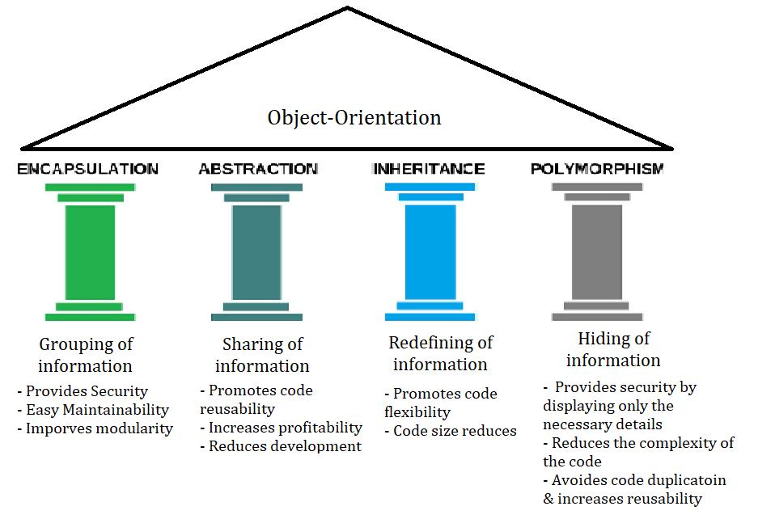
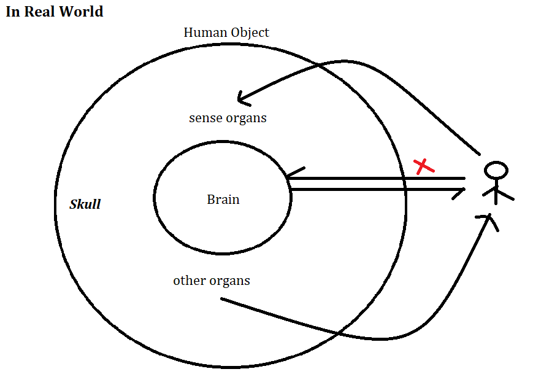
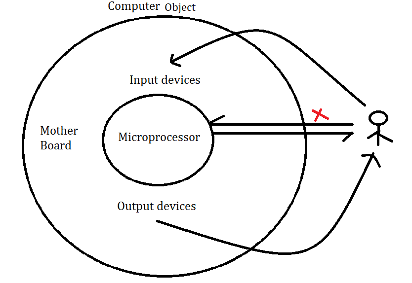
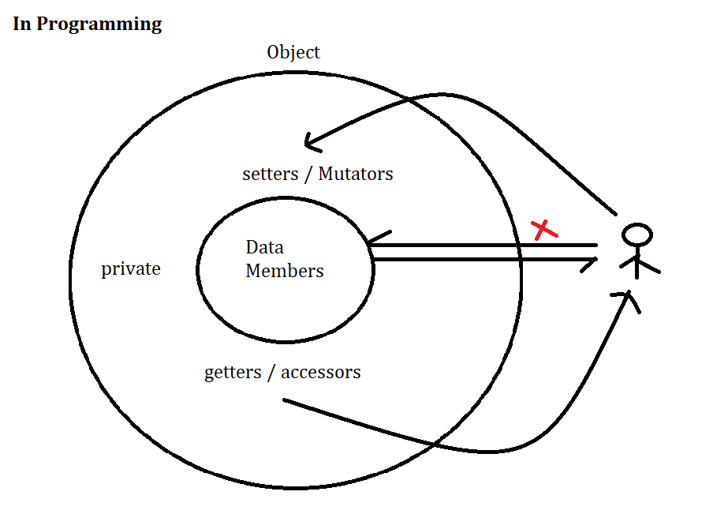
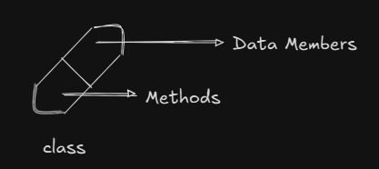
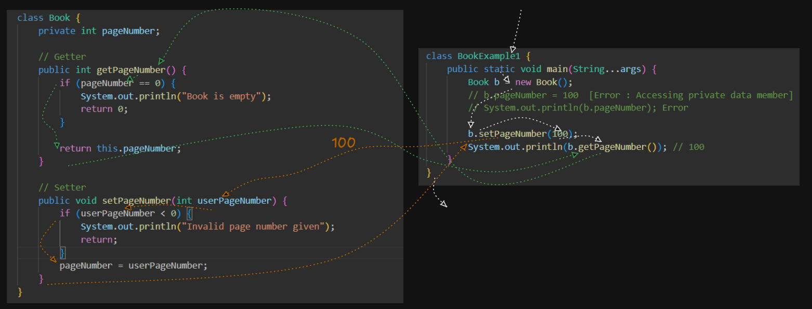
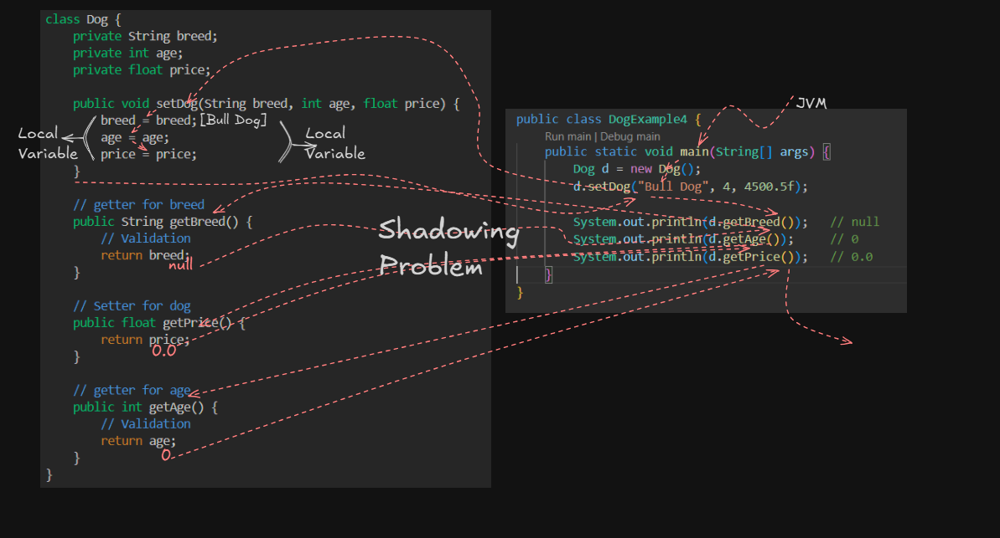

# Pillers of Object Orientated Programming

<p>
    
</p>

## Data Encapsulation in Java

- Encapsulation referes to the process of providing security to the most important component of an object
- In java, the most important of a class/object are the data members.
- Security to the data members can be provided by preventing direct access and providing controlled access
- Direct access can be prevented by decalaring the data members as private members. Controlled access can be provided by using 'public setters()' and 'public getters()' or accessors and mutators
- This is also refered to as data hiding as the data members are hidden from other classes.


### Data Encapsulation in Real World

<p>
    
    <p align="center">1. Human Object</p>
</p>
<br>
<p>
    
    <p align="center">2. Computer Object</p>
</p>

### Data Encapsulation in Java Program

<p>
    
    <p align="center">Object In Java</p>
</p>

- Encapsulation does not mean preventing access, it means providing controlled access.
- Encapsulation is also referred to as wraping of data(variables) and code acting on the data (methods) together as a single unit(class).
<p align="center">
    
    <p align="center">Class</p>
</p>

```java
class Example {
    dataMembers 
        +
    Methods
}
```

### Advantages of encapsulation
1. Security
2. Maintainability
3. Modularity

### Steps to implement encapsulation in java
1. Declare the variables of a class as private
2. Provide public getters and setters methods to modify & view the variabls values

Examples : 


> Program - 1

- [Java Program](./encapsulation/BookExample1.java)
<p align="center">
    
    <p align="center">Program-1</p>
</p>


> Program - 2.a : Encapsulated dog class 

- [Java Program](./encapsulation/DogExample2.java)


```java
class Dog {
    private String breed;
    private int age;
    private float price;

    // getter for breed
    public String getBreed() {
        // Validation
        return breed;
    }
    
    // Setter for dog
    public void setBreed(String userBreed) {
        // Validation
        breed = userBreed;
    }
    
    // getter for age
    public int getAge() {
        // Validation
        return age;
    }
    
    // Setter for age
    public void setAge(int userAge) {
        // Validation
        age = userAge;
    }
    
    // getter for price
    public float getPrice() {
        // Validation
        return price;
    }
    
    // Setter for price
    public void setPrice(float userPrice) {
        // Validation
        price = userPrice;
    }
}

public class DogExample2 {
    public static void main(String[] args) {
        Dog d = new Dog();
        d.setAge(5);   
        d.setBreed("");   
        d.setPrice(123.4f);
        System.out.println(d.getBreed());   
        System.out.println(d.getAge());   
        System.out.println(d.getPrice());   
    }
}
```

### General Syntax of setters and getters 

```java
public void setXXX(T t) // Setter
public T getXXX() // Getter
```

> Where , XXX is the name of tha data member , T -> data type of data member

> Program - 2.B : Encapsulated dog class 

- [Java Program](./encapsulation/DogExample3.java)


<h2 align="center"> Shadowing Problem in Java </h2>

- It is convention in java that withing a setter, the local variables should have the same name as that of the instance variables to improve the readability.
- Because of this convention, a name clash occurs between the local variables and the instance variables.
- Whenever there is a name clash between the 2 variables having the same name, the variable in the inner scope (local variables) will shadow the variable in the outer scope(instance variables). Hence the name class is referred to as the **Shadowing problem**

> Program - 2.B : Encapsulated dog class 

- [Java Program](./encapsulation/DogExample4.java)

<p align="center">
    
    <p align="center">Program-2B</p>
</p>

<p align="center">
    
    <p align="center">Memory Map for above Program</p>
</p>