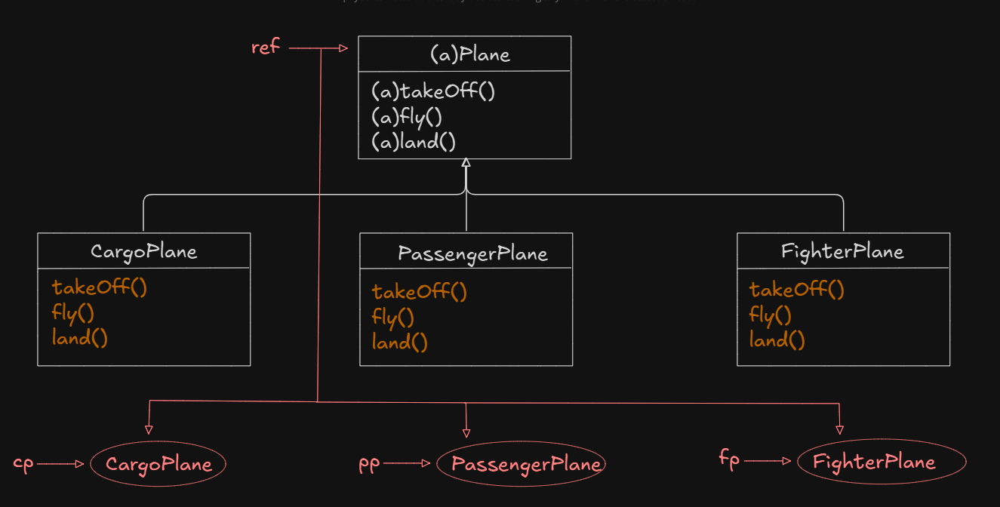
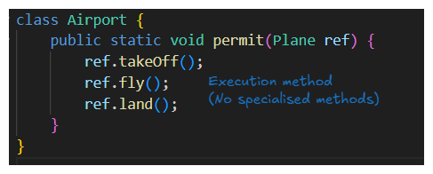
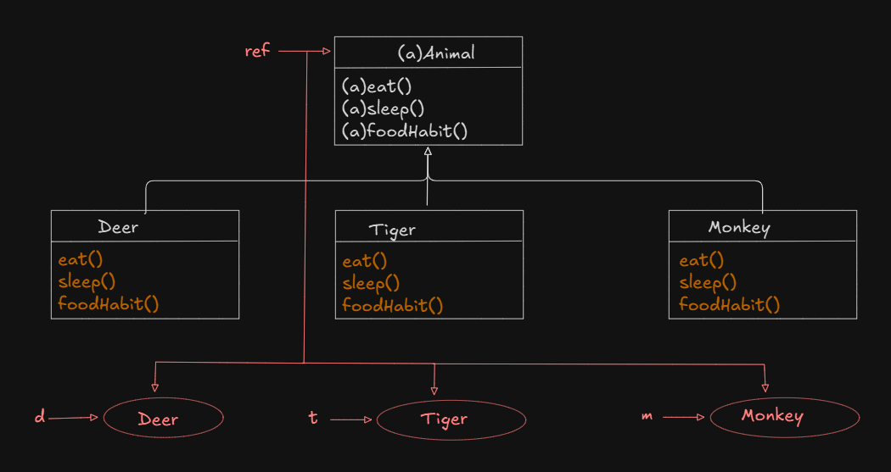
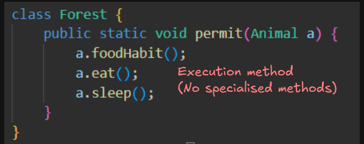
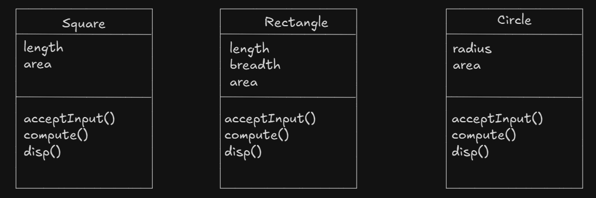
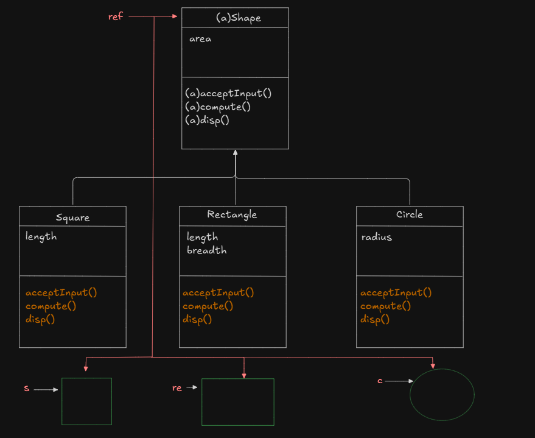

# Abstraction in Java

Ex-1 : 

    

- [Java code of abstraction example in PlaneApp](./examples/intro/PlaneApp.java)

    

Ex-2 : 

    

- [Java code of abstraction example in AnimalApp](./examples/intro/AnimalApp.java)

    

NOTE:

- Abstraction allows us to show only the relevant information and hide unneccessary details.
- This means that we hide the implementation details from the users and exposee only the functionality to the end user. Therefore the users will only know "what it does" rather than "how it does".

Examples:

1. We know what email does but we don't know how the email server uses the protocol to send the message.
2. We know what SMS does but we don't know the internal processing of messgae delivery.
3. We know what the accelerator in a car do but we don't know how pressing the accelerator increase the speed.

- In java, abstraction is achieved using `abstract` classess(0% to 100%) and interfaces (100%). We can achieve 100% abstraction using interfaces.
 

#### Abstract classes:

- There are situations in which we want to define a `super` class that only defines a <u>generic</u> form without providing implementation, that will be shared by all of its subclasses, leaving the resposibility of providing the implementation details to each of its subclass. Such class must be declared with the `abstract` keyword.
- Since an `abstract class` is an incomplete class, it cannot be instantiated 

#### Abstract Methods

- Abstract methods are such methods which contains only the signature of the method but not implementation (method body). 
- The advantage of abstract methods is that abstract methods ensures that the method in the child classes do not become specialised methods instead they remain as overridden method. Hence, loose coupling and polymorphoism can be achieved.

NOTE : If a class contains atleast one abstract method then the class must be declared as abstract.

## Design and develop and application to calculate area of different geometric shapes

$\text{Area of square} = l * l$
$\text{Area of rectangle} = l * b$
$\text{Area of rectangle} = \pi * r * r$

### Non-object oriented version

    
    
 UML 

- [Java code](./examples/intro/GeometricShapesNonObjectOriented.java)

### Object Oriented version

    
    
 UML 

- [Java code](./geometric_shapes/)