# Encapsulation

## Data Encapsulation in Java

- Encapsulation referes to the process of providing security to the most important component of an object
- In java, the most important of a class/object are the data members.
- Security to the data members can be provided by preventing direct access and providing controlled access
- Direct access can be prevented by decalaring the data members as private members. Controlled access can be provided by using 'public setters()' and 'public getters()' or accessors and mutators
- This is also refered to as data hiding as the data members are hidden from other classes.


### Data Encapsulation in Real World

<p>
    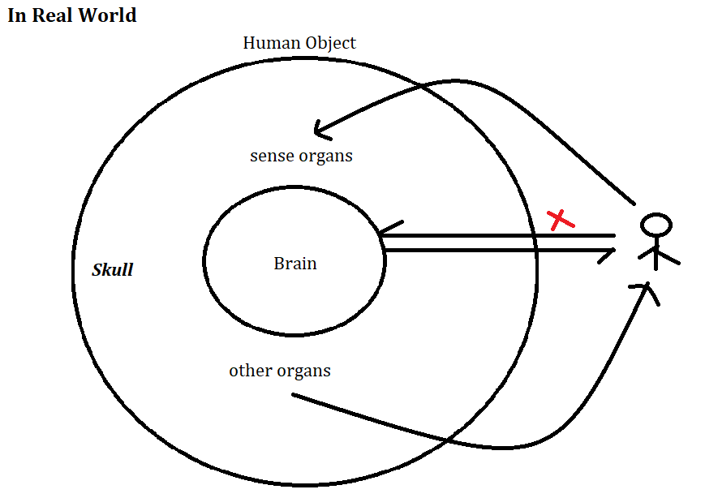
    <p align="center">1. Human Object</p>
</p>
<br>
<p>
    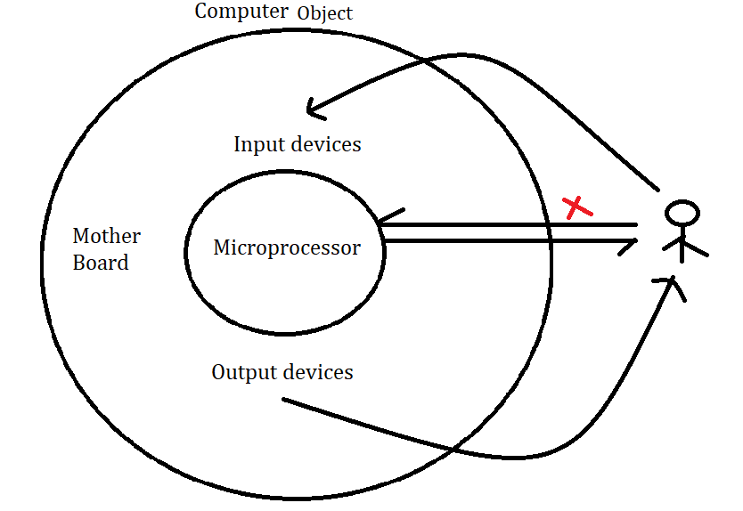
    <p align="center">2. Computer Object</p>
</p>

### Data Encapsulation in Java Program

<p>
    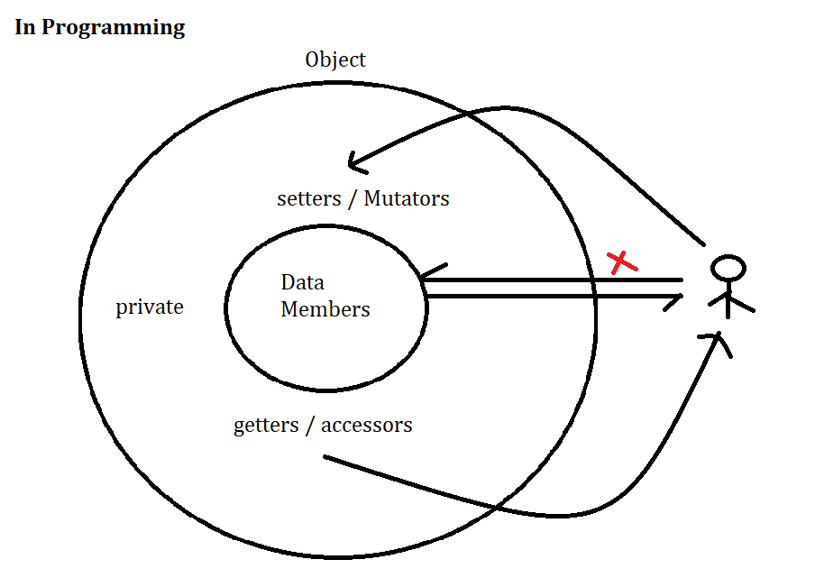
    <p align="center">Object In Java</p>
</p>

- Encapsulation does not mean preventing access, it means providing controlled access.
- Encapsulation is also referred to as wraping of data(variables) and code acting on the data (methods) together as a single unit(class).
<p align="center">
    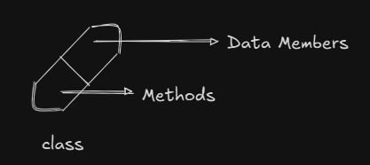
    <p align="center">Class</p>
</p>

```java
class Example {
    dataMembers 
        +
    Methods
}
```

### Advantages of encapsulation
1. Security
2. Maintainability
3. Modularity

### Steps to implement encapsulation in java
1. Declare the variables of a class as private
2. Provide public getters and setters methods to modify & view the variabls values

Examples : 


> Program - 1

- [Java Program](./example/BookExample1.java)
<p align="center">
    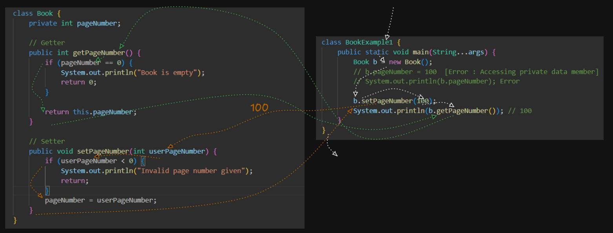
    <p align="center">Program-1</p>
</p>


> Program - 2.a : Encapsulated dog class 

- [Java Program](./example/DogExample2.java)


### General Syntax of setters and getters 

```java
public void setXXX(T t) // Setter
public T getXXX() // Getter
```

> Where , XXX is the name of tha data member , T -> data type of data member

> Program - 2.B : Encapsulated dog class 

- [Java Program](./example/DogExample3.java)


<h2 align="center"> Shadowing Problem in Java </h2>

- It is convention in java that within a setter, the local variables should have the same name as that of the instance variables to improve the readability.
- Because of this convention, a name clash occurs between the local variables and the instance variables.
- Whenever there is a name clash between the 2 variables having the same name, the variable in the inner scope (local variables) will shadow the variable in the outer scope(instance variables). Hence the name class is referred to as the **Shadowing problem**

> Program - 2.B : Encapsulated dog class 

- [Java Program](./example/DogExample4.java)

<p align="center">
    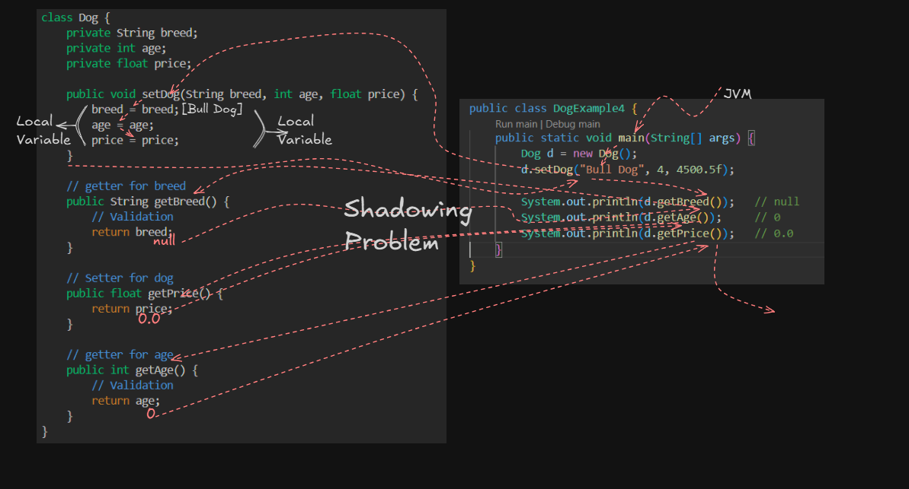
    <p align="center">Program-2B</p>
</p>

<p align="center">
    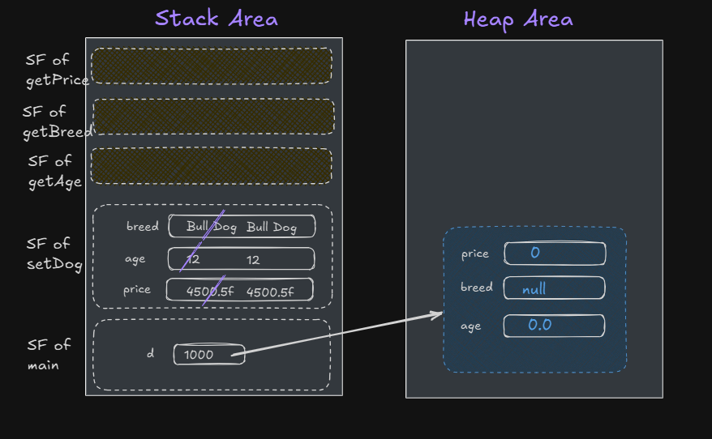
    <p align="center">Memory Map for above Program</p>
</p>

> NOTE : The shadowing problem can be resolved by making use of `this` keyword. 

> Program - 2.C : Encapsulated dog class 

- [Java Program](./example/DogExample5.java)

<p align="center">
    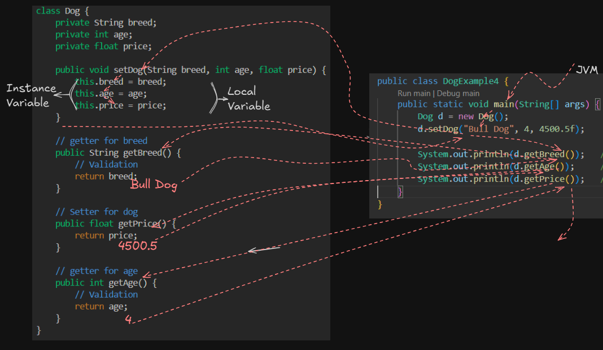
    <p align="center">Program-2C</p>
</p>

<p align="center">
    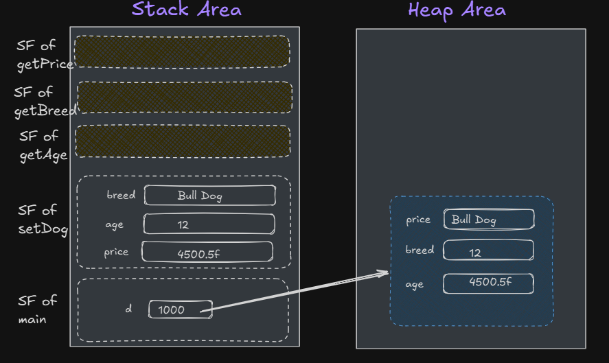
    <p align="center">Memory Map for above Program</p>
</p>

## <p align="center">Constructors in Java</p>

- A constructor is a specialised setter which has the same names as that of the class.
- A constructor does not return any value and hence it can not have a return type.
- A constructor is invoked during the object creation.
- A constructor is used to initialise the newly created object.


Example - 1:
- [Java Program](./example/DogExample6.java)

> The above program after compilation will look like:

<p align="center">
    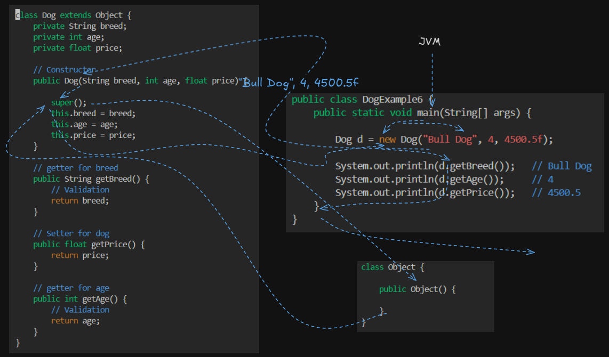
    <p align="center">Constructor Program - 1</p>
</p>

<p align="center">
    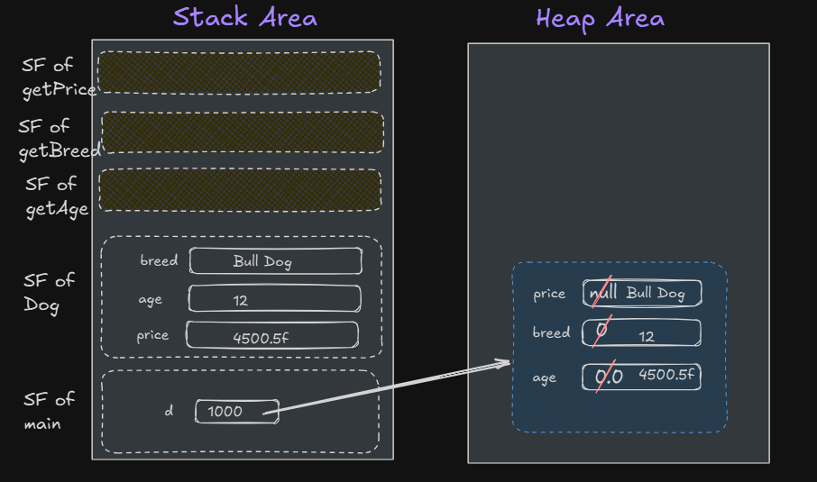
    <p align="center">Memory Map for above Program</p>
</p>


### <p align="center">Note : Object creation </p>

<p align="center">
    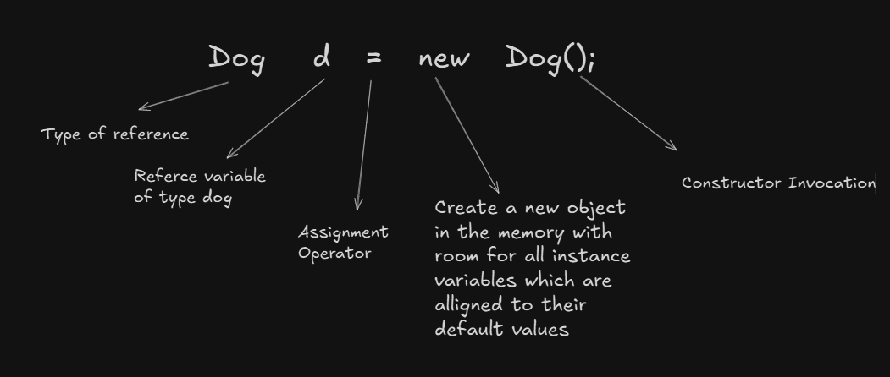
</p>


- The new operator does the following:
    - Creates an object by allocating the memory
    - Invokes the costructor
    - Returns a reference to that object

- The new operator requires a single argument: a call to a constructor. The name of the constructor provides the name of the class to instantiate

- All classes have atleast one costructor
- If a class does not explicitly declare any constructor then the java compiler automatically provide a no argument constructor called as the default constructor (Zero-parametrized constructor)

- The default constructor will call the no-argument constructor of the super class using the `super()` call.

Example 2: 

- [Java Program](./example/DogExample7.java)

The above program after compiled:

<p align="center">
    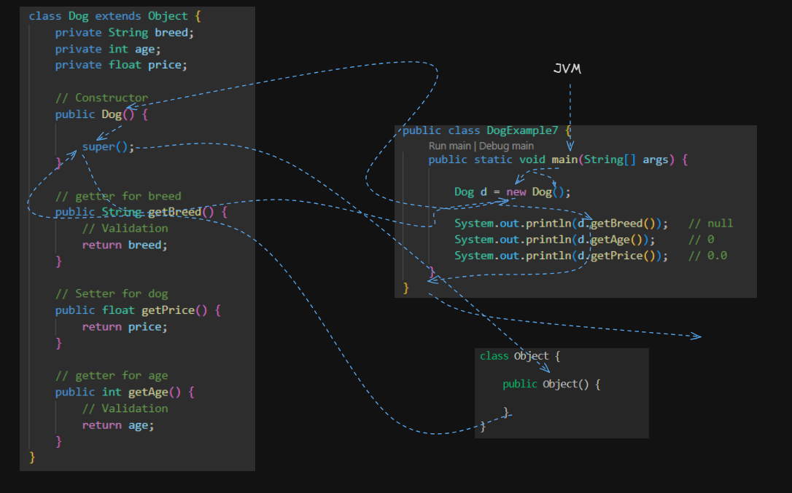
    <p align="center">Constructor Program - 2</p>
</p>

<p align="center">
    
    <p align="center">Memory Map for above Program</p>
</p>


Example 3: 

- [Java Program](./example/DogExample8.java)

The above program after compiled:

<p align="center">
    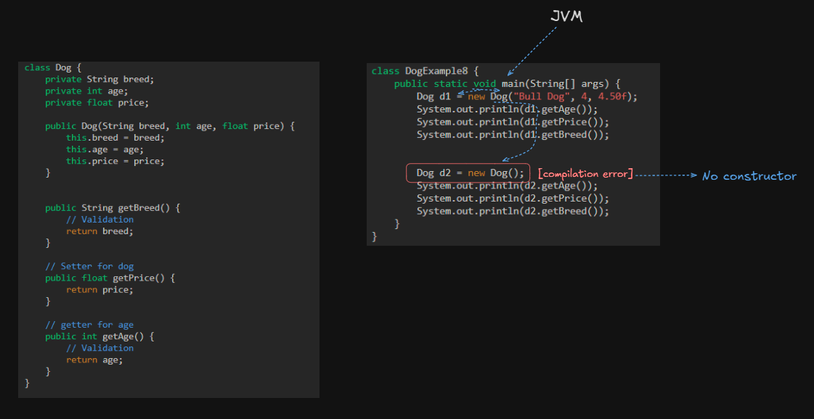
    <p align="center">Constructor Program - 3</p>
</p>


Important Points : 

1. If a class contain atleast one constructor then java compiler will not define the constructor.
2. Hence to overcome the above error we have to explicitly provide zero parametrized constructor.
3. The process of creating multiple constructor with diffrent parameter within the same class is called constructor overloading.


Example 4: 

- [Java Program](./example/DogExample9.java)
<p align="center">
    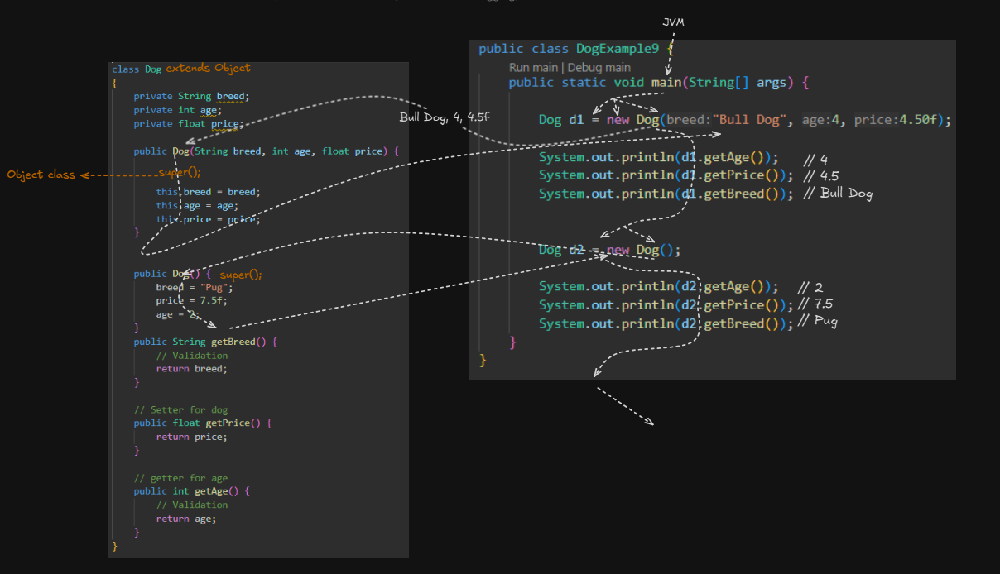
    <p align="center">Constructor Program - 4</p>
</p>

<p align="center">
    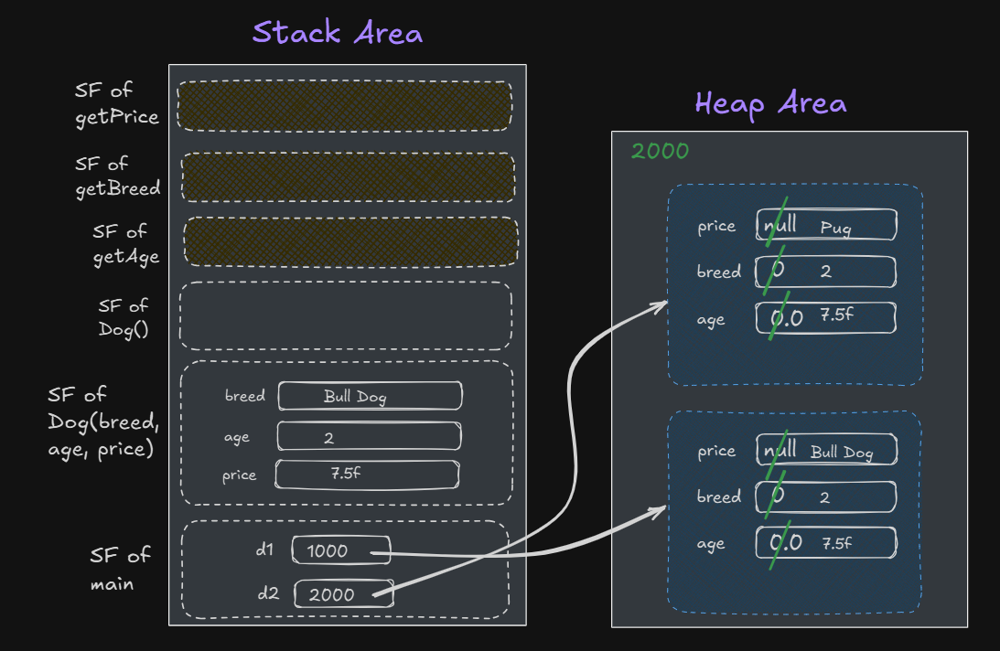
    <p align="center">Memory Map for above Program</p>
</p>

- Types of constructor
1. Default constructor
2. No arg constructor (zero parametrized constructor)
3. Parameterized constructor

### Constructor Chaining

- The process of one constructor calling another constructor is called as **constructor chaining**.
- Constructor chaining can be done in 2 ways:
1. Within the same calss : It can be achieved using `this()`.
2. Between the subclass and the super class : It can be achieved by using `super()`

- The first line within a constructor can be either `super()` constructor call or `this()` constructor call. This ensures the parent class object is in proper state before referring to within the child class constructor.
- If there is no explicit call to `super()` or `this()`, the java compiler automatically inserts a call to `super()`.
- There must exist atleast one constructor that does not use `this()` to avoid recursive constructor calls.
- `this()` or `super()` should always be the first statement inside a constructor.

Example-5:
- [Java Program](./example/DogExample10.java)

<p align="center">
    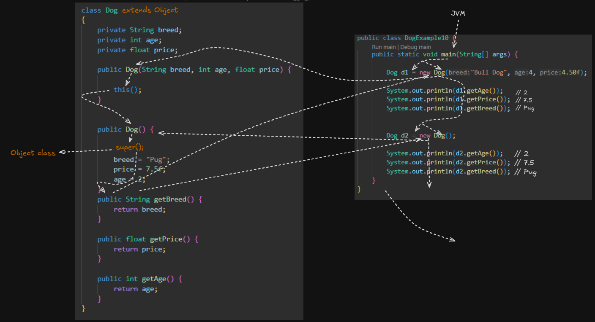
    <p align="center">Constructor Program - 5</p>
</p>

<p align="center">
    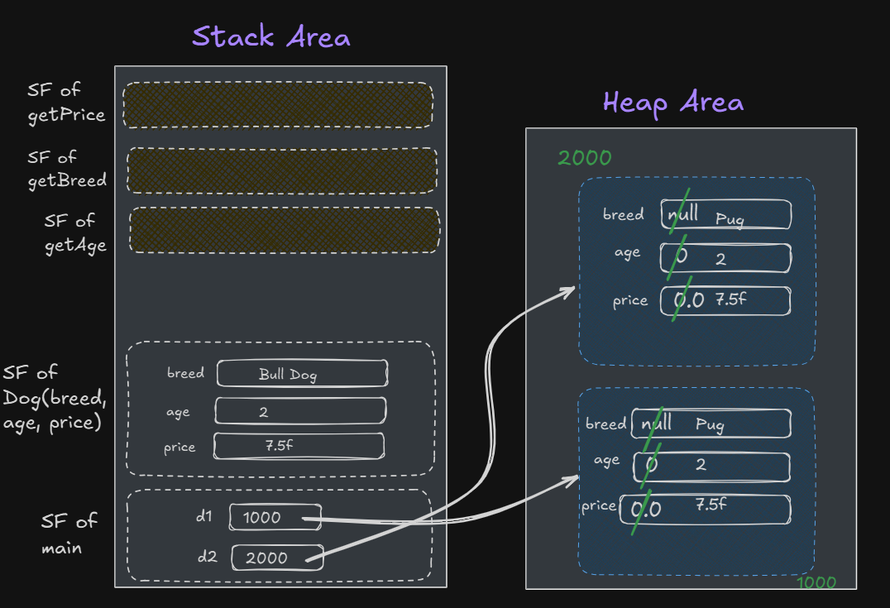
    <p align="center">Memory Map for above Program</p>
</p>

Example-6:

- [Java Program](./example/DogExample11.java)

<p align="center">
    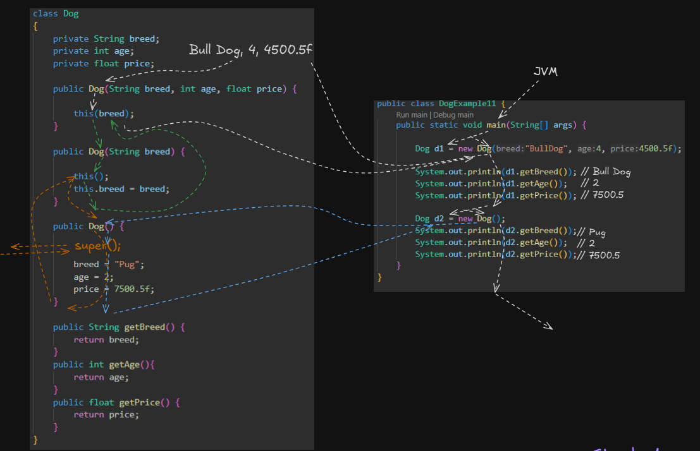
    <p align="center">Constructor Program - 5</p>
</p>

<p align="center">
    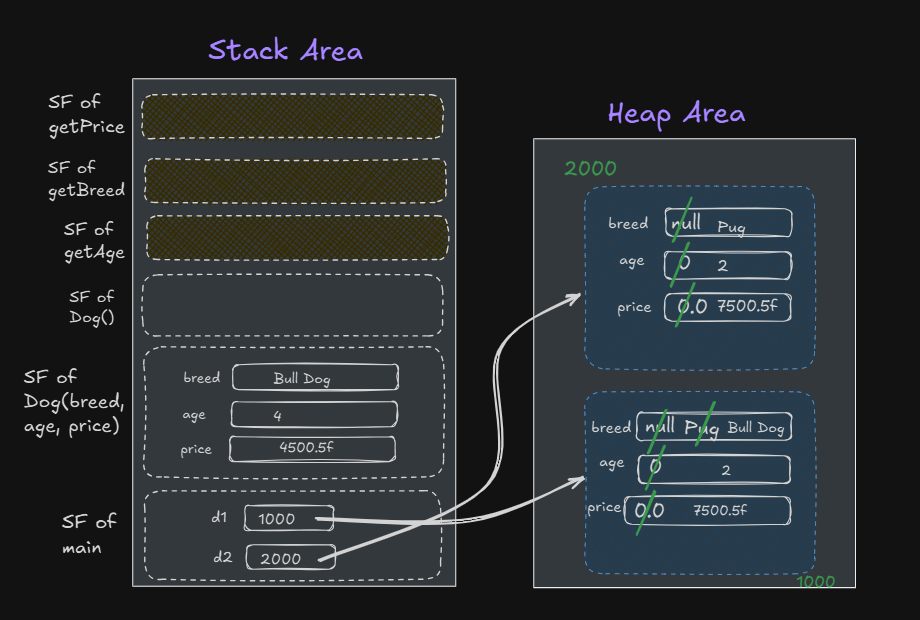
    <p align="center">Memory Map for above Program</p>
</p>


> Difference between constructor and methods:

|Sr|Constructor| Methods|
|--|-----------|--------|
|1. | A constructor is used to initialise an object. | A method is used to exhibit functionality (behaviour) of an object.|
|2. | Constructors are invoked implicitly by the new operator. | Methods are invoked explicitly by the programmer. |
|3. | Constructor does not return any value. | A method may or may not return a value.|
|4. | Constructor cannot have a return type. | A method must have a return type.|
|5. | In case if a constructor is not present, a default constructor is provided by java compiler. | In case of methods no default method is provided.|
|6. | The constructor should have the same name as that of the class. | A method can have any name.|
|7. | The first statement within a constructor must always be `super()` or `this()`| The first statement within a method can be anything|
|8. | Constructors can't be inherited. | Non-private methods can be inherited. |