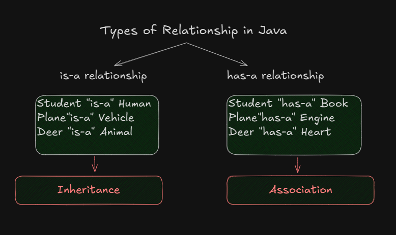

# Inheritance In Java

<p>
    
</p>

Story of Shilpa Shetty and Vijay Malya :
<p>
    
    <p align="center"> Deal With Company-1</p>
    
    <p align="center"> Deal With Company-2</p>
    
</p>

> Inheritance refers to the process of coding a project not as a single class, but as a hierarchy of classes

> Inheritance represents, the "is-a" relationship

> Which is also known as <u>parent-child relationship</u>

>  Inheritance is such a programming mechanism provided by most programming languages particularly object oriented in which the objects of the child class, acquires all the properties(data) and behaviours(methods) of an object of the parent class.

#### Advantages
1. Promotes reusability
2. Reduces code redundancy
3. Less development time and effort
4. Increases profits 
5. Supports code extensibility

## Rules of inheritance

### 1. Single inheritance enables a child class to inherit from a single parent class.
- Single inheritance is permitted in java 

[Java Code](./example/Rule1.java)
<p>
    
</p>

### 2. Multilevel inheritance

[Java Code](./example/Rule2.java)
- In multilevel inheritance, a child class inherits from a parent class and the child class also acts as the parent class to another class 

- Multi-level inheritance is permitted in java 
<p>
    
</p>

### 3. Hierarchial inheritance 
- In hierarchial inheritance, one class serves as a parent class to more than one child class
- Hierarchial inheritance is permitted in java 
<p>
    
</p>

### 4. Multiple inheritance 
- In multiple inheritance, a child class can inherit from more than one parent class.
- Multiple inheritance is not permitted in java as it leads to ambiguity. This is popularly know as **Diamond-Shape Problem**.
<p>
    
</p>


### 5. Hybrid inheritance 
- Hybrid inheritance is a combination of any two or more types of inheritance. 
- Hybrid inheritance is conditionally permitted in java.

<p>
    
</p>

### 6. Cyclic Inheritance
- In cyclic inheritance, 
    1. A class inherits itself
    2. Two classes inherits from each other, forming a loop or cycle.

- Cyclic Inheritance is not permitted in java.

```java
class Demo1 extends Demo1 {

}
```

```java
class Demo1 extends Demo2 {

    }
class Demo2 extends Demo1 {

}
```

<p>
    
</p>

### 7. Private access modifier
- Private members of a class do not participate in inheritance.
- Private members are accessible only within the same class.
- This rule is implemented in order to preserve the piller of encapsulation.
- However, `non-private` members of the parent class can be inherited by the child class

[Java Code](./example/Rule7.java)

<p>
    
</p>

### 8. Constructor
- Constructors of a class do not participate in inheritance.
- Though constructor do not get inherited, they will be executed because of the `super()`.
[Java Code](./example/Rule8.java)

<p>
    
</p>


## Access Modifiers / Access Specifier in java

1. Access Modifiers in java
    1. `public` 
    2. `protected`
    3. `<default>`
    4. `private`
    5. `static`
    6. `final`
    7. `synchronized` .. etc

2. Access Specifiers in C, C++, etc.

Access Specifiers:
    1. `public` 
    2. `protected`
    3. `<default>`
    4. `private`

Access Modifiers:
    1. `static`
    2. `const`


<p>
    
    <i align="center">Access Modifiers in java</i>
</p>

- Access modifiers are `keyword` that are used to define accessibility (visibility) of memebers of a class.

Access Levels 

|**Access Modifiers** | **With the same class** | **Outside the class but in the same package** | **Outside the package but in the related classed** | **Outside the package & in  unrelated classes** |
|---|-|-|-|-|
|*public*| Yes| Yes| Yes| Yes|
|*protected*| Yes| Yes| Yes| No|
|*`<default>`*| Yes| Yes| No| No|
|*private*| Yes| No| No| No|


### Following are the access modifiers in java:

#### 1. (+) `public`
- public members  are accessible everywhere in the project

#### 2. (#) `protected`
- protected members  are accessible within the same pacakge and outside the package in related class.

#### 3. (+) `default`
- default members  are accessible only within the same pacakge(package-private modifier
)

#### 4. (~) `private`
- private members  are accessible only within the same class

NOTE:

<p>
    
    <i align="center">Access Modifiers in java</i>
</p>

There are two level of access modifiers:
1. At the top level: `public` or `<default>`
2. At the member-level: `public`, `protected`, `<default>` and `private`


### `packages` in java

- A package is container of a group of related classes 
Syntax : 
```java
package pacakgename;
```

- naming convention of package : Packages are named in reverse order of domain names.

For flipkart.com
Ex. : package com.flipkart;  


### `import` statement in java

- The `import` keyword is used to imoprt in-built and user definbed packages.

### Accessing package members

1. Using fully-qualified name (without using import statement)
Ex:
```java
java.util.Scanner sc = new java.util.Scanner(System.in); 
```

2. Importing a specific pacakge members
```java
import java.util.Scanner;
import java.util.ArrayList;
```

3. Importing an entire pacakge

```java
import java.util.*;

Scanner sc = new Scanner(System.in);
ArrayList al = new ArrayList();
```

NOTE: 
> The statement `import java.*`, it will only import the members of "java" package and not the members if its sub-packages(util, math, etc)

- `java.lang` package contains classes that are fundamenta to the design of java. Hence it is by default imported in every java program


### static import statement in java

- With the help of static import, we can access the static member of a class directly without using class name or any object

- [Example code, using Math class methods](./example/ImportStatement.java)


from java-5 :
```java
import static java.util.Math.*;  // All static members from math class are imported
```
- [Example code, static import of Math class methods](./example/ImportStatement2.java)

