# Inheritance In Java

<p>
    
</p>

Story of Shilpa Shetty and Vijay Malya :
<p>
    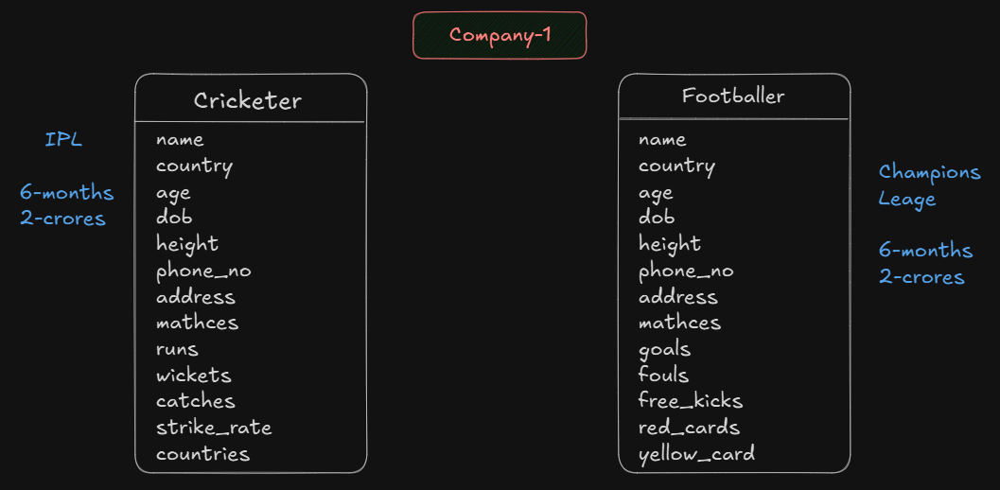
    <p align="center"> Deal With Company-1</p>
    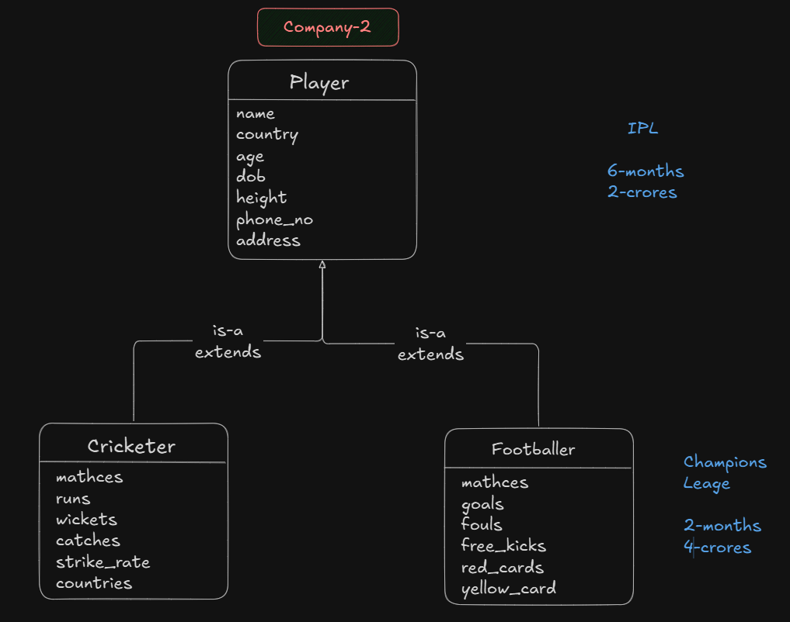
    <p align="center"> Deal With Company-2</p>

</p>

> Inheritance refers to the process of coding a project not as a single class, but as a hierarchy of classes

> Inheritance represents, the "is-a" relationship

> Which is also known as <u>parent-child relationship</u>

> Inheritance is such a programming mechanism provided by most programming languages particularly object oriented in which the objects of the child class, acquires all the properties(data) and behaviours(methods) of an object of the parent class.

#### Advantages

1. Promotes reusability
2. Reduces code redundancy
3. Less development time and effort
4. Increases profits
5. Supports code extensibility

## Rules of inheritance

### 1. Single inheritance enables a child class to inherit from a single parent class

- Single inheritance is permitted in java

[Java Code](./example/Rule1.java)
<p>
    
</p>

### 2. Multilevel inheritance

[Java Code](./example/Rule2.java)

- In multilevel inheritance, a child class inherits from a parent class and the child class also acts as the parent class to another class

- Multi-level inheritance is permitted in java

<p>
    
</p>

### 3. Hierarchial inheritance

- In hierarchial inheritance, one class serves as a parent class to more than one child class
- Hierarchial inheritance is permitted in java

<p>
    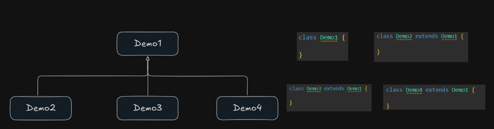
</p>

### 4. Multiple inheritance

- In multiple inheritance, a child class can inherit from more than one parent class.
- Multiple inheritance is not permitted in java as it leads to ambiguity. This is popularly know as **Diamond-Shape Problem**.

<p>
    
</p>

### 5. Hybrid inheritance

- Hybrid inheritance is a combination of any two or more types of inheritance.
- Hybrid inheritance is conditionally permitted in java.

<p>
    
</p>

### 6. Cyclic Inheritance

- In cyclic inheritance,
    1. A class inherits itself
    2. Two classes inherits from each other, forming a loop or cycle.

- Cyclic Inheritance is not permitted in java.

```java
class Demo1 extends Demo1 {

}
```

```java
class Demo1 extends Demo2 {

    }
class Demo2 extends Demo1 {

}
```

<p>
    
</p>

### 7. Private access modifier

- Private members of a class do not participate in inheritance.
- Private members are accessible only within the same class.
- This rule is implemented in order to preserve the piller of encapsulation.
- However, `non-private` members of the parent class can be inherited by the child class

[Java Code](./example/Rule7.java)

<p>
    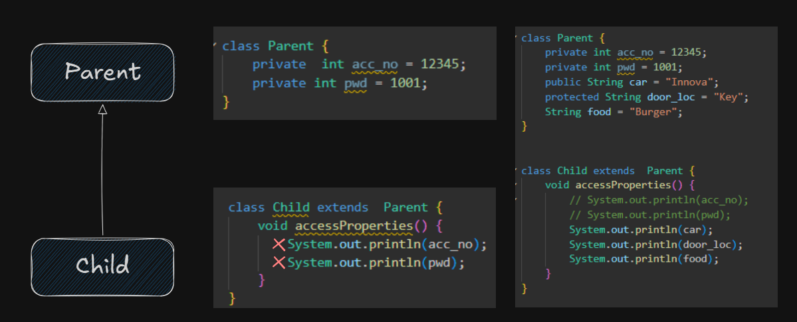
</p>

### 8. Constructor

- Constructors of a class do not participate in inheritance.
- Though constructor do not get inherited, they will be executed because of the `super()`.
[Java Code](./example/Rule8.java)

<p>
    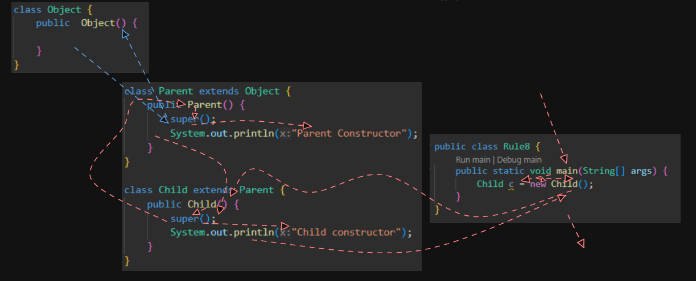
</p>

## Access Modifiers / Access Specifier in java

1. Access Modifiers in java
    1. `public`
    2. `protected`
    3. `<default>`
    4. `private`
    5. `static`
    6. `final`
    7. `synchronized` .. etc

2. Access Specifiers in C, C++, etc.

Access Specifiers:
    1. `public`
    2. `protected`
    3. `<default>`
    4. `private`

Access Modifiers:
    1. `static`
    2. `const`

<p>
    
    <i align="center">Access Modifiers in java</i>
</p>

- Access modifiers are `keyword` that are used to define accessibility (visibility) of memebers of a class.

Access Levels

|**Access Modifiers** | **With the same class** | **Outside the class but in the same package** | **Outside the package but in the related class** | **Outside the package & in  unrelated classes** |
|---|-|-|-|-|
|*public*| Yes| Yes| Yes| Yes|
|*protected*| Yes| Yes| Yes| No|
|*`<default>`*| Yes| Yes| No| No|
|*private*| Yes| No| No| No|

### Following are the access modifiers in java

#### 1. (+) `public`

- public members  are accessible everywhere in the project

#### 2. (#) `protected`

- protected members  are accessible within the same pacakge and outside the package in related class.

#### 3. (+) `default`

- default members  are accessible only within the same pacakge(package-private modifier
)

#### 4. (~) `private`

- private members  are accessible only within the same class

NOTE:

<p>
    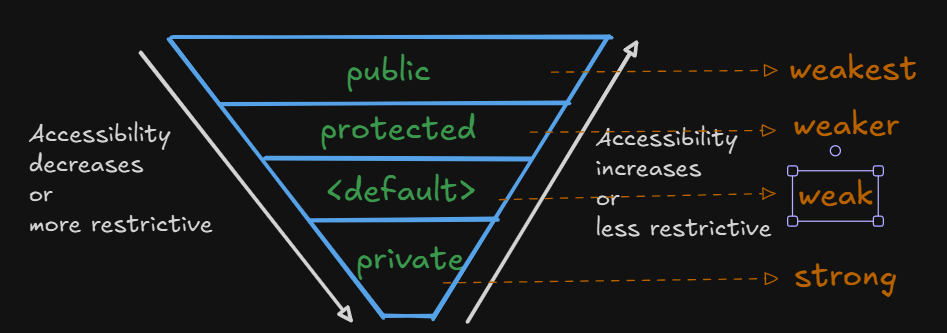
    <p align="center">Access Modifiers in java</p>
</p>

There are two level of access modifiers:

1. At the top level: `public` or `<default>`
2. At the member-level: `public`, `protected`, `<default>` and `private`

### `packages` in java

- A package is container of a group of related classes
Syntax :

```java
package pacakgename;
```

- naming convention of package : Packages are named in reverse order of domain names.

For flipkart.com
Ex. : package com.flipkart;  

### `import` statement in java

- The `import` keyword is used to imoprt in-built and user defined packages.

### Accessing package members

1. Using fully-qualified name (without using import statement)
Ex:

```java
java.util.Scanner sc = new java.util.Scanner(System.in); 
```

2. Importing a specific pacakge members

```java
import java.util.Scanner;
import java.util.ArrayList;
```

3. Importing an entire pacakge

```java
import java.util.*;

Scanner sc = new Scanner(System.in);
ArrayList al = new ArrayList();
```

NOTE:
> The statement `import java.*`, it will only import the members of "java" package and not the members if its sub-packages(util, math, etc)

- `java.lang` package contains classes that are fundamental to the design of java. Hence it is by default imported in every java program

### `static` import statement in java

- With the help of static import, we can access the static member of a class directly without using class name or any object

- [Example code, using Math class methods](./example/ImportStatement.java)

from java-5 :

```java
import static java.util.Math.*;  // All static members from math class are imported
```

- [Example code, static import of Math class methods](./example/ImportStatement2.java)

## Types of methods in inheritance

<p>
    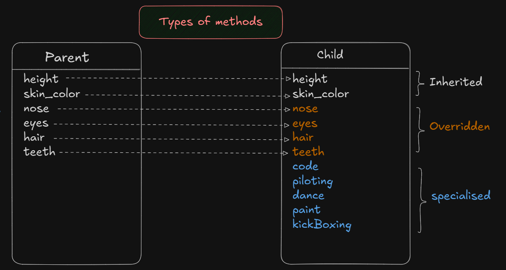
    <i align="center">Access Modifiers in java</i>
</p>

- In the context of inheritance, we can categorize the method into 3 categories:

#### 1. Inherited Methods

- There are such methods which have been inherited from the parent class and used as it is.

Advantage: Code Reusability

#### 2. Overridden Methods

- There are such methods which have been inherited from the parent class and modified to suit the expectations of the child class.

Advantage: Can change the behaviour according to the expectation of the child class.

#### 3. Specialised Methods

- There are such method which are present only in the child class and not in the parent class.

Advantage: Enhances the features & functionalitits of the child class.

#### Example PlaneApp

<p>
    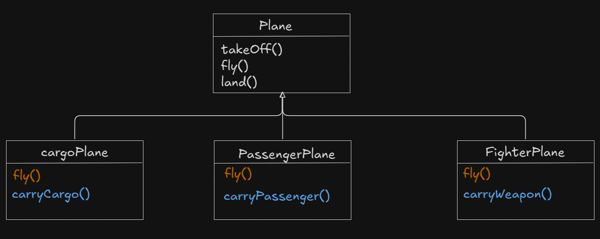
    <p align="center">UML Diagram of PlaneApp</p>
</p>

[Java Program for planeApp](./example/PlaneApp.java)

Output:

```text
Plane is taking offf...
Cargo Plane is flying at lower heights..
Cargo plane is carrying goods...
Plane is landing...
Plane is taking offf...
Passenger Plane is flying at medium heights..
Passenger plane is carrying passengers...
Plane is landing...
Plane is taking offf...
Fighter Plane is flying at higher heights..
Fighter plane is carrying weapons...
Plane is landing...
```

#### Example Animal App

<p>
    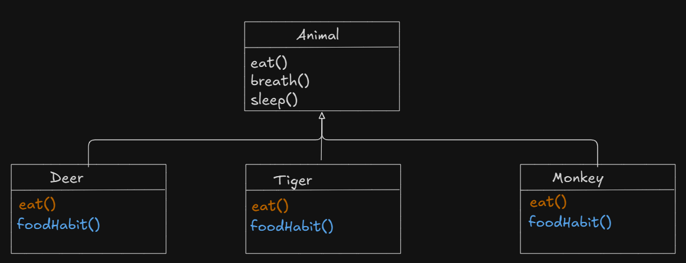
    <p align="center">UML Diagram of Animal App</p>
</p>

[Java Program for Animal App](./example/AnimalApp.java)

Output:

```text
Animal is breathing...
Deer grazes and eats grass...
Deers are herbivores
Animal is sleeping...
Animal is breathing...
Tigers hunts and eats...
Tigers are carnivores
Animal is sleeping...
Animal is breathing...
Monkey snatches and eats...
Monkeys are omnivores
Animal is sleeping...
```

### Method Overriding in java

- Method *overriding* allows a child class to reimplement a method which is inhertied a from parent class.

Example :

<p>
    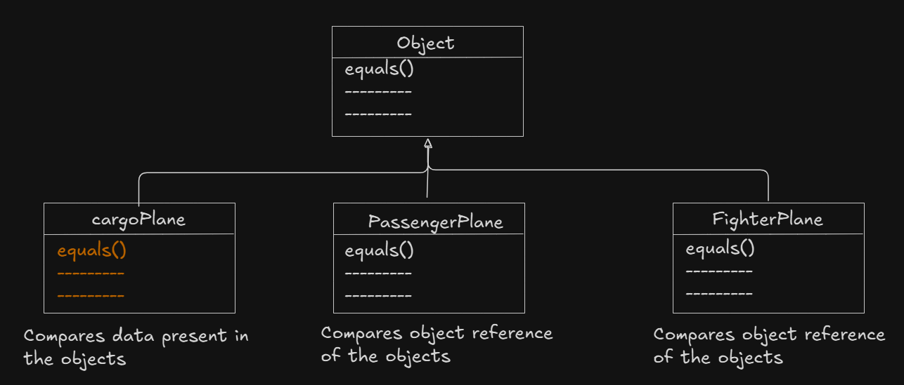
    <p align="center">Method Overriding example of String and Mutable string classes</p>
</p>

#### Rules of method overriding

**Rule : 1**

- Access level of the overridden method in the child class cannot tbe more restrictive. In other words, the child class overridden method must retains the same access modifier as that of the parent class of method. Howerver, it's possible to change the access modifier of the overridden method in the child class provided it is less restrictive.

Ex. :

<p>
    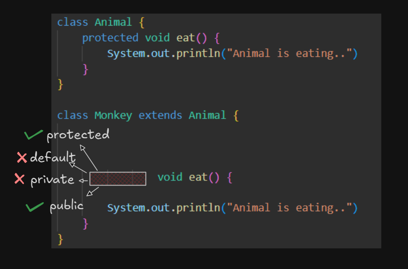
</p>

**Rule : 2**

- i. Return type of the overridden method cannot be changed *(primitive return type)*

<p>
    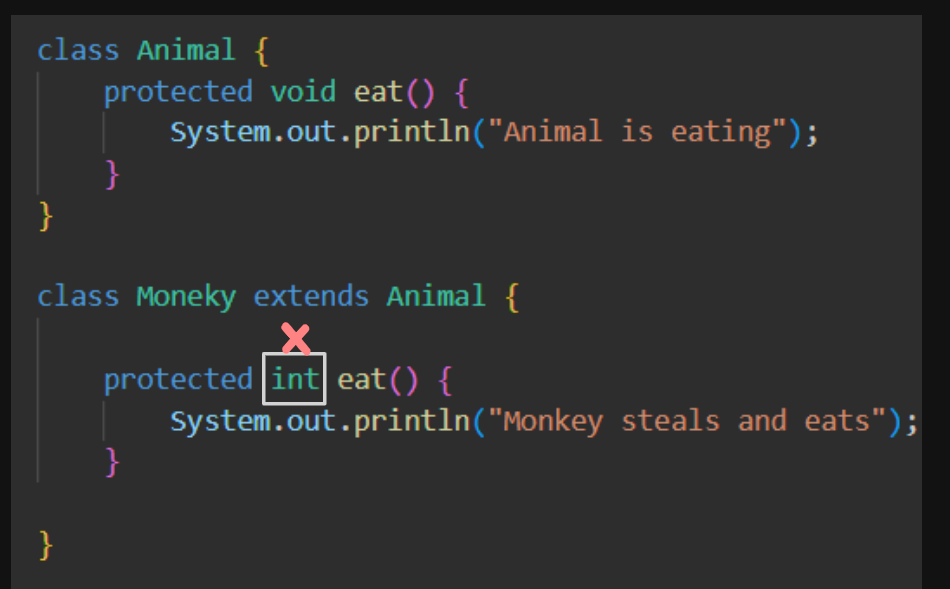
</p>

- ii. However, it is possible to change the return type provided. They are co-variant return types

<p>
    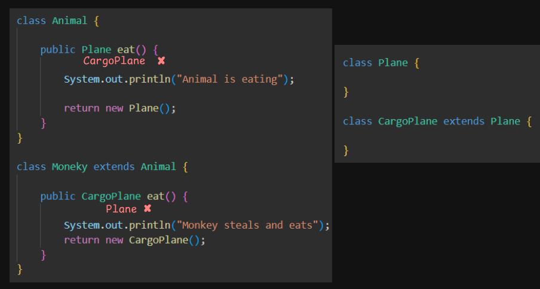
</p>

NOTE : Covariant Return types
> It is possible to have different return type for overriding method in the child class provided overridden method and return type should be a sub-type of parent class method's return type.

> In this way, overriding method becomes variant with respect to return type. This way possible from JDK 1.5 onwards

**Rule : 3**

- The argument list should be exactly the same as that of the parent class method

<p>
    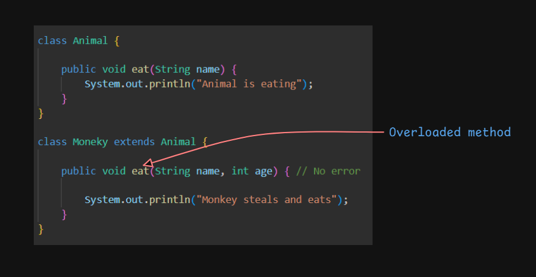
</p>

**Rule : 4**

- Private members cannot be overridden as they don't participate in inheritance

```java

class Animal {
    
    private void eat() {
        System.out.println("Animal is eating");
    }
}

class Moneky extends Animal {
    
    public void eat() { // Specialised method of monkey class

        System.out.println("Monkey steals and eats");
    }
}
        
```

### Difference between method overloading and method overriding

| Sr No |Method Overloading | Method Overriding |
|-|-|-|
| 1. | Methods have the same name but with different paremeters. | Methods have the same name with same parameters.|
| 2. | It occurs in the same class. | Occurs between parent and child class. |
| 3. | Return types can be same or different. | Return types must be same or co-variant. |
| 4. | Facilitates ease of use. | Facilitates specific implementation for child classes. |
| 5. | Promotes compile-time polymorphism | Promotes runtime polymorphism. |
| 6. | Comparatively high in performance. | Compartively low in performance. |
| 7. | Static methods can be overloaded.  | Static methods cannot be overridden. |

## Constructors execution in inheritance

#### Case-1 : Whenever a child class object is created, the parent class constructor will be executed first followed by the child class constructor because of the `super()`

[Example code](./example/ConsExecutionCase1.java)

<p>
    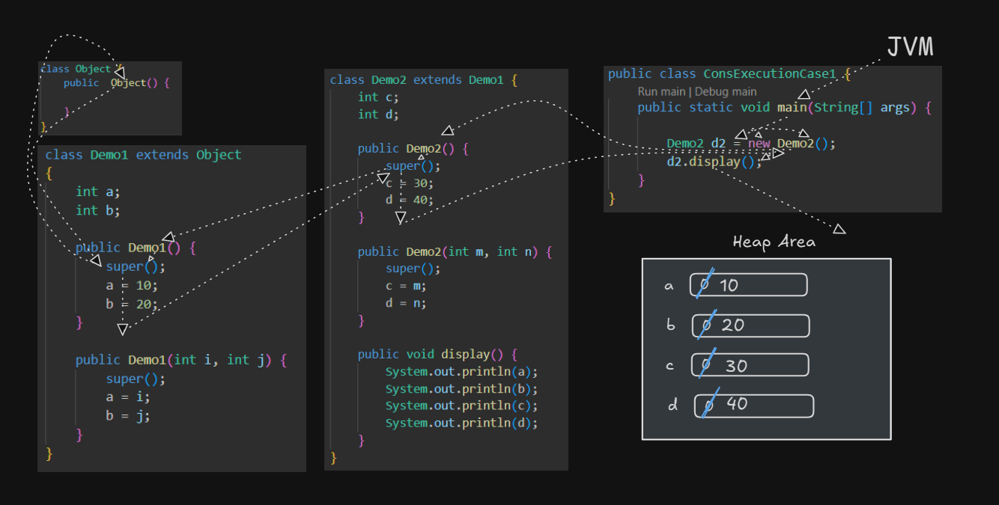
    <p align="center"> Memory Map and Flow of execution </p>
</p>

#### Case-2

[Example code](./example/ConsExecutionCase2.java)

<p>
    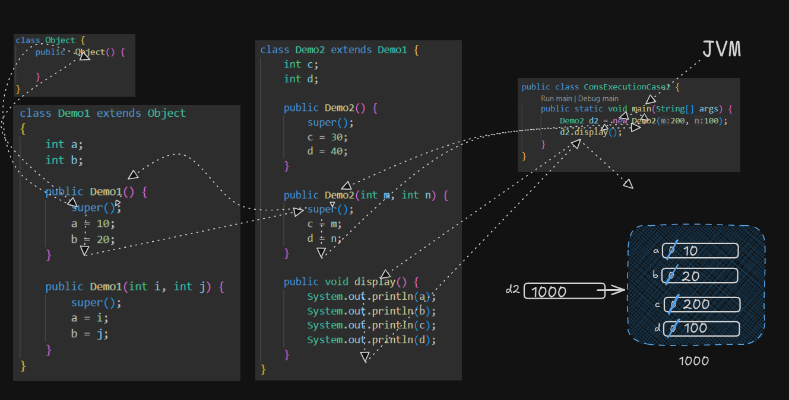
    <p align="center"> Memory Map and Flow of execution </p>
</p>

#### Case-3

[Example code](./example/ConsExecutionCase3.java)

<p>
    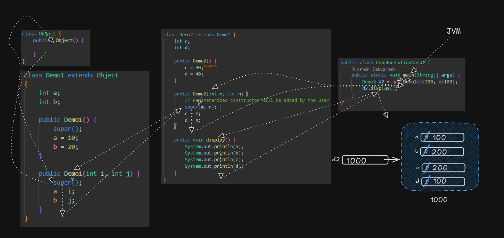
    <p align="center"> Memory Map and Flow of execution </p>
</p>

#### Case-4 : `super()` or `this()` must always be the first statement within a constructor. This prevents accesing uninitialized parent members

[Example code](./example/ConsExecutionCase4.java)

<p>
    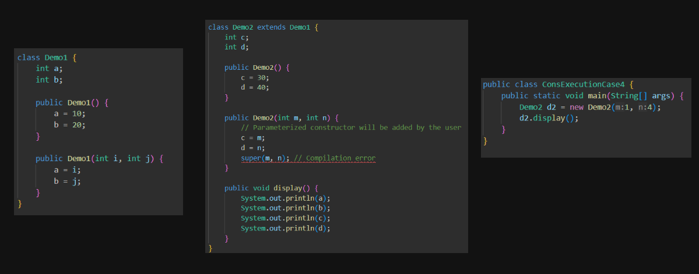
    <p align="center"> Memory Map and Flow of execution </p>
</p>

#### Case-5

[Example code](./example/ConsExecutionCase5.java)

<p>
    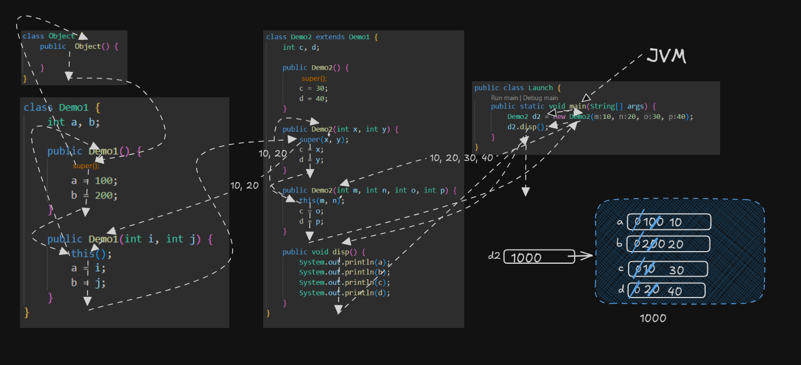
    <p align="center"> Memory Map and Flow of execution </p>
</p>

### Special cases of `this` and `super` keyword

[Codes in this folder](./example/special_cases_of_super_and_this)

- Variable hiding occurs when a child class defines a variable with the same name as its parent, preventing direct access to the parent's variable unless accessed via super. Variable resolution is based on the reference type at compile-time.

<p>
    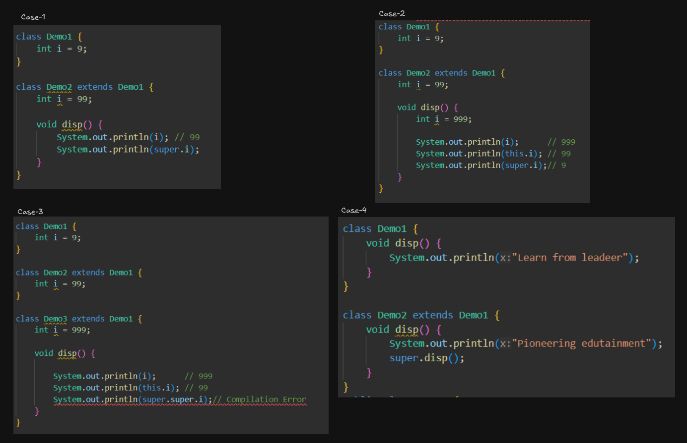
</p>

## Static Inheritance

1. Ex1:

[Example code](./example/static_inheritance/Ex1.java)

<p>
    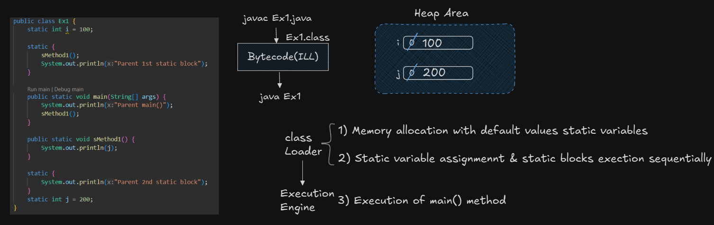
</p>

Output:

```text
0
Parent 1st static block
Parent 2nd static block
Parent main()
200
```

2. Ex2:

[Example code](./example/static_inheritance/Ex2.java)

<p>
    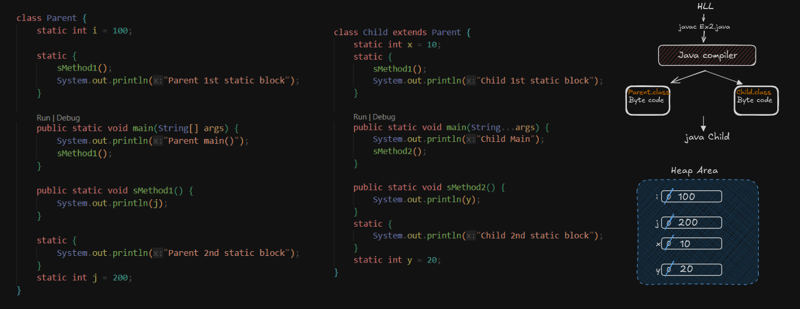
</p>

Output:

```text
0
Parent 1st static block
Parent 2nd static block
200
Child 1st static block
Child 2nd static block
Child Main
20
```

1. First `Parent` class will be loaded in class loader.
1. Memory allocation with default values for static variables of `Parent` class.
2. Static variables assignments and static blocks execution sequentially of `Parent`class.
3. Then `Child` class will be loaded in class loader.
1. Memory allocation with default values for static variables of `Child` class.
2. Static variables assignments and static blocks execution sequentially of `Child`class.
5. Main method execution

NOTE: If the execution is done as `java Parent` then only the Parent class static members will be executed. (output will be same as example-1)

## Instance Inheritance

1. Ex: 1

[Example code](./example/instance_inheritance/Ex1.java)

<p>
    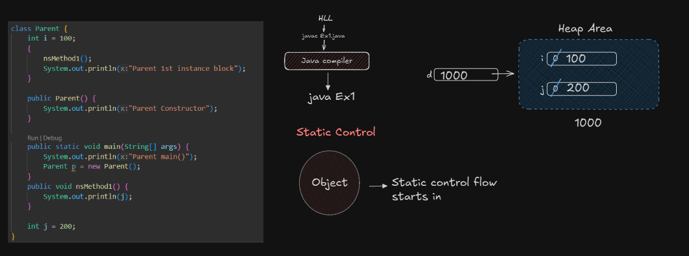
</p>

```text
Parent main()
0
Parent 1st instance block
Parent Constructor
```

Steps :

Within a static context, if an object is created then the instance control flow sets in as :

1. Memory allocation with default values for instance variables
2. Instance varible assignments and instance blocks execution sequentially
3. Execution of constructors

2. Ex: 2

[Example code](./example/instance_inheritance/Ex2.java)

<p>
    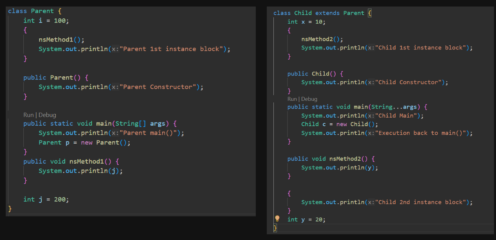
</p>

```text
0
Parent 1st static block
Parent 2nd static block
200
Child 1st static block
Child 2nd static block
Child Main
20
```

Steps :

Within a static context, if an object is created then the instance control flow sets in as :

1. Memory allocation with default values for instance variables
2. Instance varible assignments and instance blocks execution sequentially
3. Execution of constructors

3. Ex: 3

[Example code](./example/instance_inheritance/Ex3.java)

<p>
    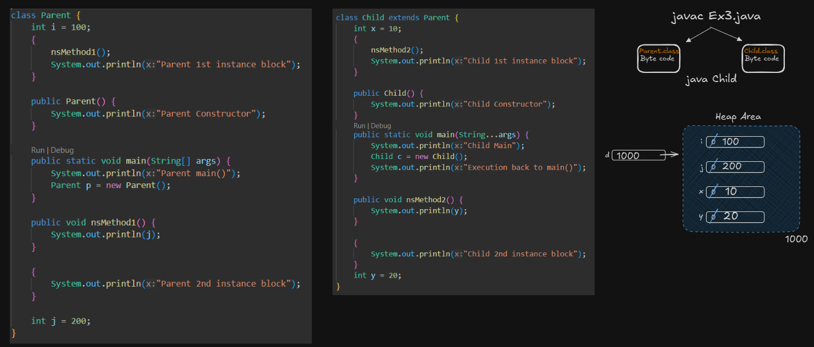
</p>

Output:

```text
Child Main
0
Parent 1st instance block
Parent 2nd instance block
Parent Constructor
0
Child 1st instance block
Child 2nd instance block
Child Constructor
Execution back to main()
```

Steps :

1. Memory allocation for instance variables with default values from parent to child.
2. Instance variable assignment and instance block execution sequentially only for parent class.
3. Executoin of parent constructor.
4. Instance variable assignment and instance block execution sequentially only for child class.
5. Executino of child constructors.  

<!-- Example of instance and static inheritance -->

## `final` Keyword in java

<p>
    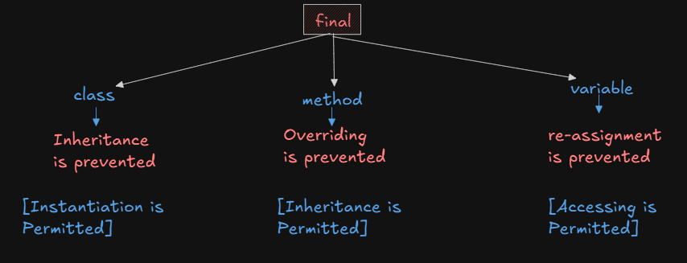
</p>

### 1. `final` Class

- If a `final` keyword is applied to a class then it cannot be inherited. However, it can be instantiated.

<p>
    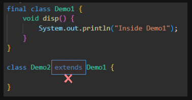
</p>

Creating new object is pemitted:

```java
Demo1 d1 = new Demo1();
```

#### 2. `final` methods

- If final keyword is applied to a method then it cannot be overridden. However, it will be inherited.

```java
class Demo1 {
    final void disp() {
        System.out.println("Inside Demo1");
    }
}

class Demo2 extends Demo1 {
    // Not pemitted : compilation error
    void disp() {
        System.out.println("Inside Demo2");
    }
}
```

We can use that method:

```java
Demo2 d2 = new Demo2();
d2.disp(); // inherited
```

Ex. : `getClass()` of `Object` class

#### 3. `final` variable

- If `final` keyword is applied to a variable, then its value cannot be changed once initialised. It will be treated as a constant.

- It is a convention in java to name the constants all in upper case character.

```java
class Demo1 {
    final int num = 10;
    final void disp() {
        num = 20;    // Compilation error
        System.out.println(num);
    }
}
```

Ex. Minimum and maximum values of the numerical data type in wrapper classes.

```java
System.out.println(Integer.MIN_VALUE);
System.out.println(Integer.MAX_VALUE);
```

```java
class Intger {
    public static final MIN_VALUE = -2147483648;
    public static final MAX_VALUE =  2147483647;
}
```

#### NOTE - 1 

1. `final` primitive variable (values cannot be changed)

```java
class Demo {
    public static void main(String...args) {
        final int i = 10;
        i = 20;  // Compilation error
    }
}
```

2. `final` reference variable (address cannot be changed)

```java

class Dog {
    int price = 6666;
}

class Demo {
    public static void main() {
        final Dog d = new Dog();
        d.price = 9999;
        d = new Dog();
    }
}
```

<p>
    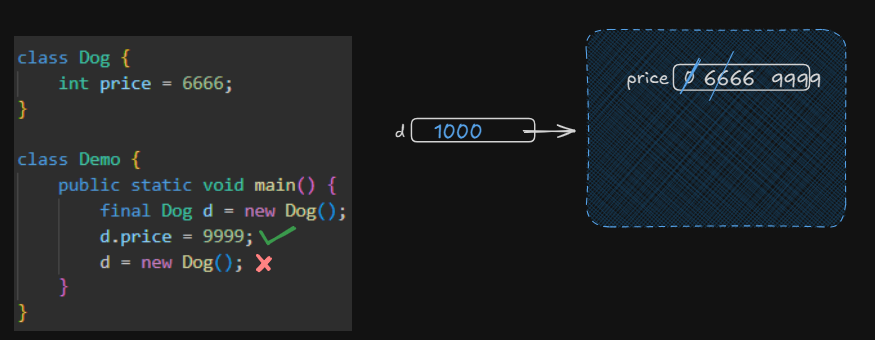
</p>

#### NOTE - 2 : `final` blank variable

<p>
    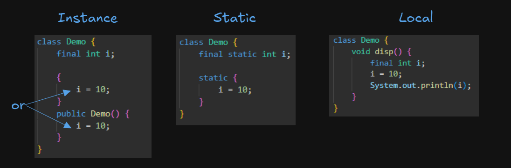
</p>


## `sealed` classes in java

- `sealed` classes, introduced in java-15(preview) and finalised in java-17, provide a way to <u>restrict inheritance</u> by specifying which classes can `extend` them.

Syntax :

A sealed class :
- uses the `sealed` keyword
- specifies permitted subclasses using `permits` keyword.
- Each permitted subclass must be `final`, `sealed` or `non-sealed`.

Example:

> [Sealed class example](./example/SealedClassEx.java)

Using keyword in subclass:

- `final` : prevents further inheritance 
- `non-sealed` : open for unrestricted inheritance
- `sealed` : restricted inheritance

<hr>

# "Has-a" Relationship In Java  
- Most commanly used relationship

- As a part of an application development, we have to use few entities (classes) as per our application requirement.

- These classes can be used by using two types of relationships:
    1. "Is-a" relationship (achieved through `extends` keyword)
    2. "Has-a" relationship (no specific keyword - it is achieved through has-a variable)

#### "Is a" relationship

- It is used to define inheritance between 2 entities in a java application 
- It promotes code reusability.

#### "Has a" relationship

- It is used to define association between 2 entities in  a java application.
- It promotes code reusability and it also improved the communication between 2 entities and data navigation between 2 entities.

<p>
    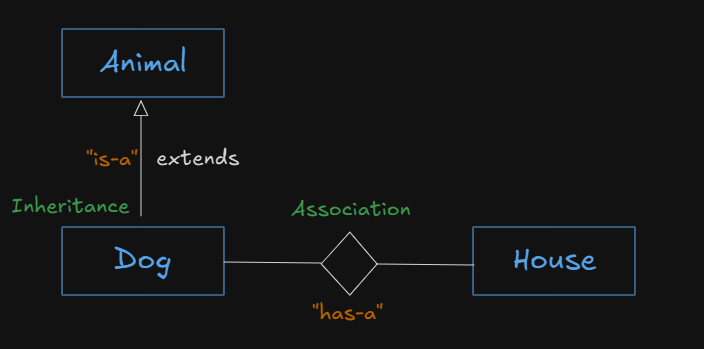
</p>


<u>Types of association in java</u>

1. One-to-one association
1. One-to-Many association
1. Many-to-one association
1. Many-to-Many association

##### Conventional 'has-a' example

> [Convention Example Code](./example/association/ConventionExample.java)

<p>
    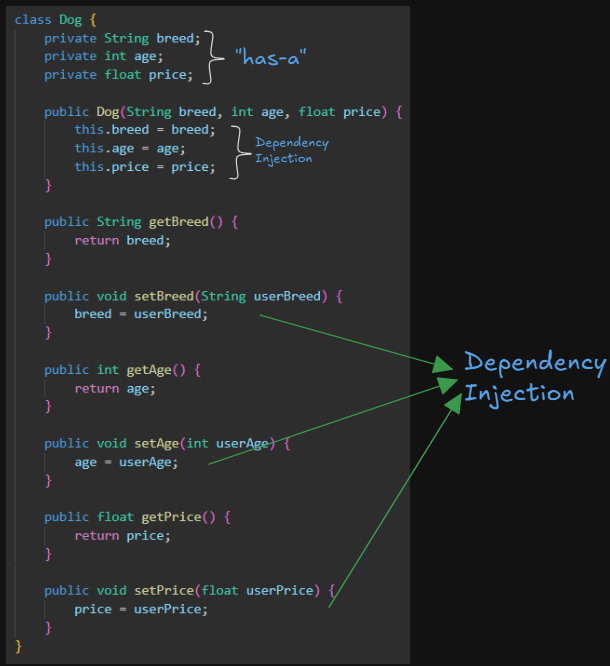
</p>

##### Standard 'has-a' example

> [Standard Example Code](./example/association/StandardExample.java)

Address -> Depenedent class

Student -> Target class

<p>
    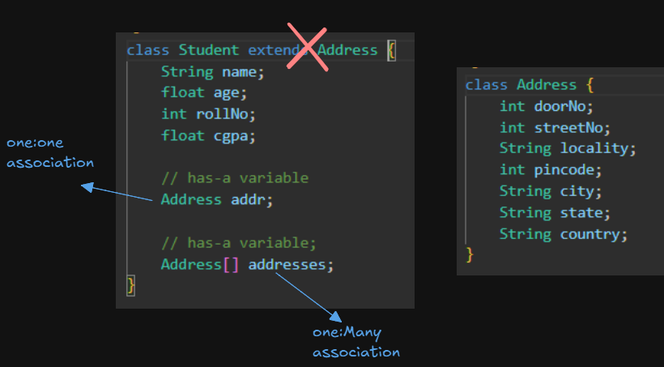
</p>

- To achieve association between 2 entitites, we have to decalere either a single reference or an array of references of an entity in another entity.

- **Dependency Injection**
- The process of injecting the depenedent object into the target object is called dependency injection. It can be performed in two ways :

    1. constructor injection
    2. Setter injection

- In both of these type of injection we can :
    - Inject a primitive value into an object
    - Inject an object into another object


<p>
    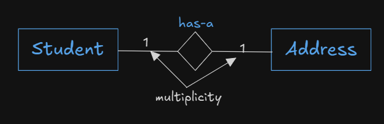
</p>


<p>
    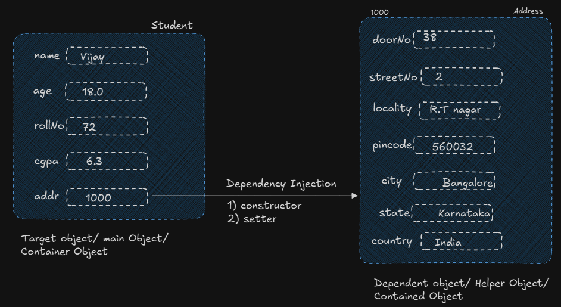
</p>


## One-to-One Association

### One-to-One association using constructor injection 

- It is a relationship between two entities where in one object of one entity is mapped to one object of another entity.

<p>
    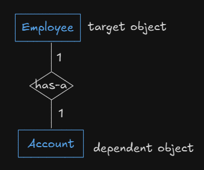
</p>

> [Java Code for One to One Constructor Injection](./example/association/OneToOneConstructor.java)

### One-to-One association using setter injection 

> [Java Code One to One Setter Injection](./example/association/OneToOneSetter.java)


> When to use constructor injection and setter injection

- **Constructor Injection**
    - If the dependent object is ready at the time target object creation, then we can perform constructor injection.

- **Setter Injection**
    - If the dependent object is not ready at the time target object creation, then we can perform setter injection.


## One-to-Many Association

- One-to-many association is a relationship between 2 entities where in one object of one entity is mapped to many object of another entity.

<p>
    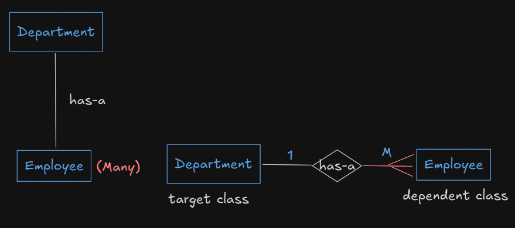
</p>

- **Dependency Injection**
    - 1. Constructor
    - 2. Setter


<p>
    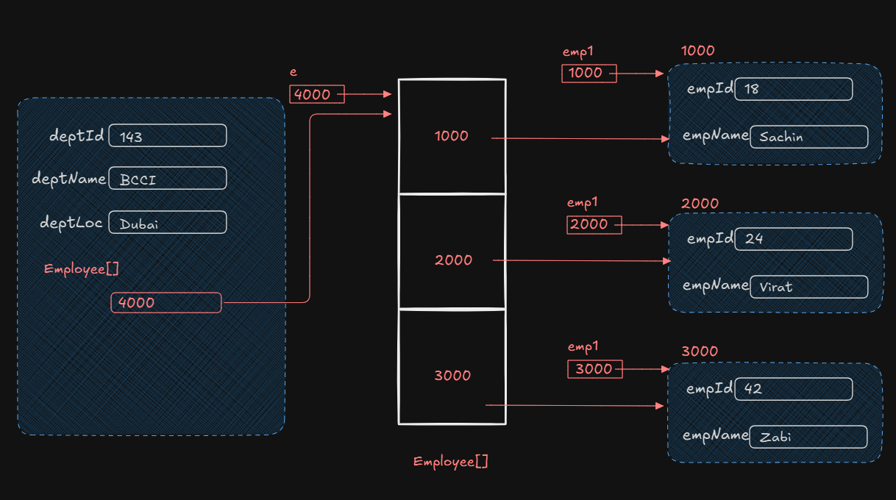
    <p align="center">Memory diagram</p>
</p>

> [Java Code One to Many Association](./example/association/OneToManyEx.java)

## Many-to-One Association

- It is a relationship between 2 entities where many objects of one entity are mapped to one object of another entity.

<p>
    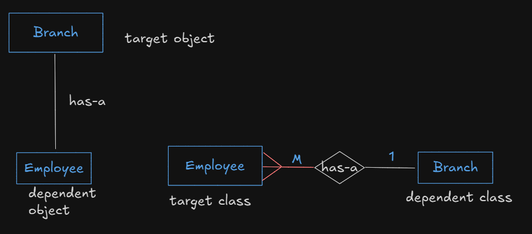
</p>

<p>
    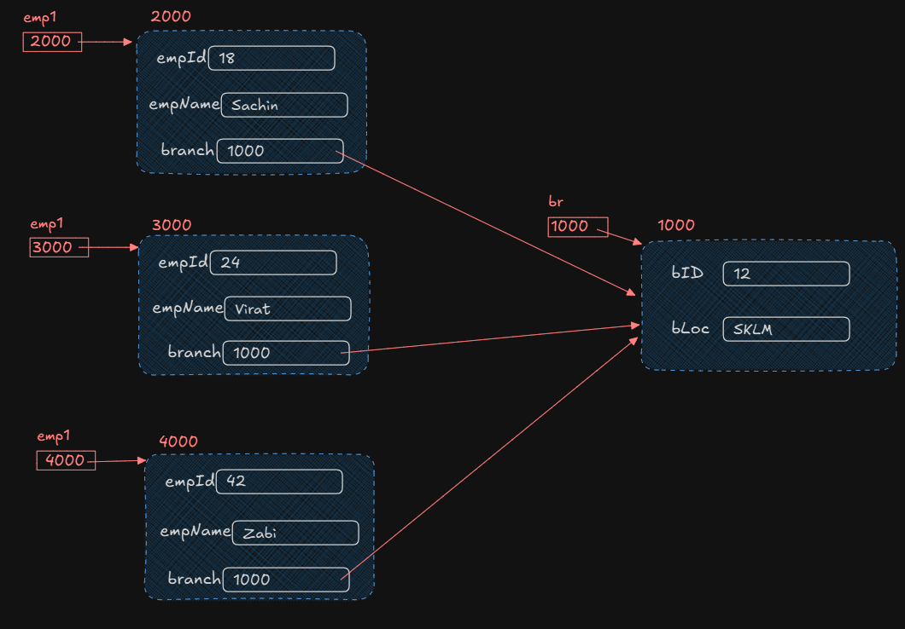
    <p align="center">Memory diagram</p>
</p>


> [Java Code Many to One Association](./example/association/ManyToOneEx.java)

## Many-to-Many Association 

- It is a relationship between and entities where many objects of one entity are mapped to mamy objects of another entity.

<p>
    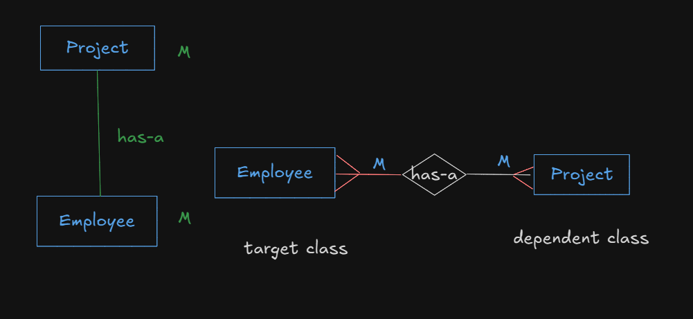
</p>

<p>
    
    <p align="center">Memory diagram</p>
</p>


> [Java Code Many to Many Association](./example/association/ManyToManyExample.java)


## Aggregation and Composition

<p>
    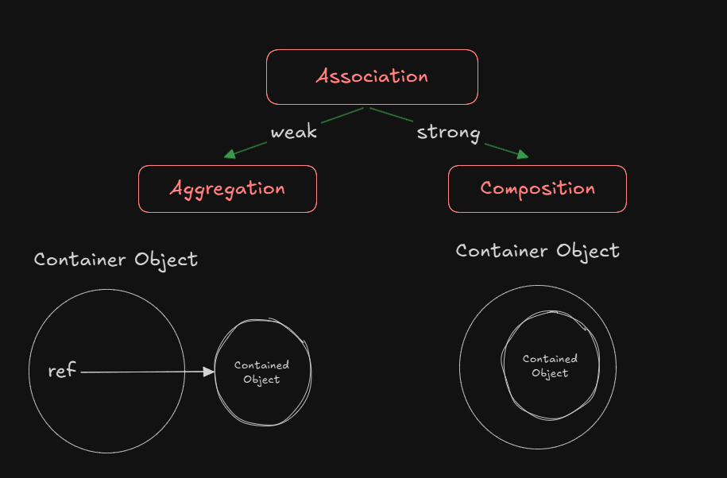
    <p align="center">Types of Association</p>
</p>

### Example - 1

<p>
    
    <p align="center">UML</p>
</p>

> [Java Code of Strength Based Association - 1](./example/association/AssociationExampleBasedOnStrength.java)

<p>
    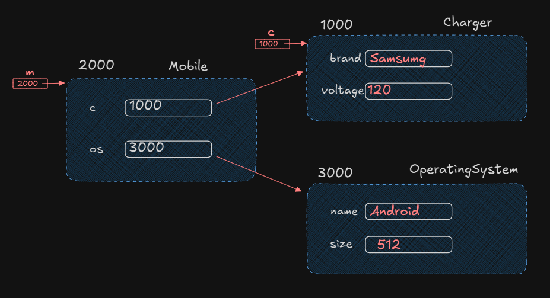
    <p align="center">Memory diagram</p>
</p>

### Example - 2

<p>
    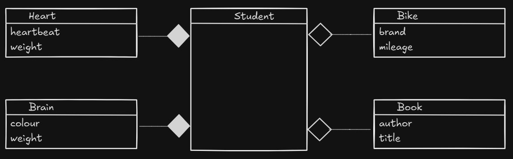
    <p align="center">UML</p>
</p>

> [Java Code of Strength Based Association - 2](./example/association/AssociationStrengthEx2.java)

<p>
    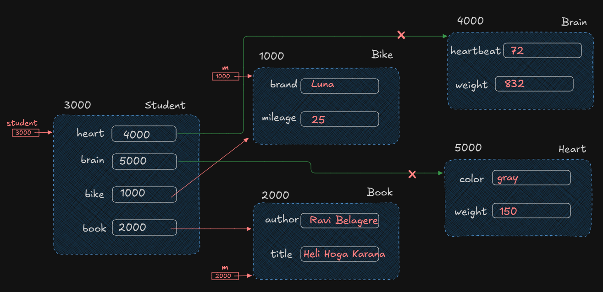
    <p align="center">Memory diagram</p>
</p>


## Real time example of Inheritance

NOTE:

- Composition is a <u>tight bound</u> `has-a` relationship (Strong association).
- Aggregation is a <u>loose bound</u> `has-a` relationship (Weak association).
- Tight bound "has-a" relationship is when the <u>enclosing object</u> is inaccessible(destroyed) even the <u>contained object remains accessible</u>.
- Loose bound "has-a" relationship is when even if the <u>enclosing object</u>. is <u>inaccessible</u>(destroyed) still the <u>contained object remains accessible</u>.


# Delegation Model

- Delegation means handover the responsibility for a particular task to another class or method.
- It is a technique where an object expresses certain behaviour to outside world but in reality delegates the responsibility for implementing the behaviour to an associated object.

<p>
    
</p>

> [Example demonstrating above image](./example/delegation/Ex1.java)
