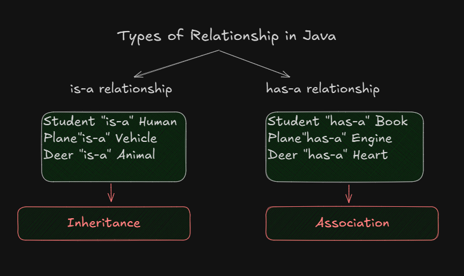
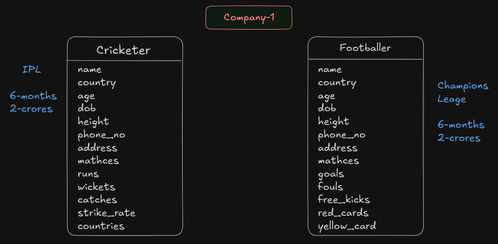
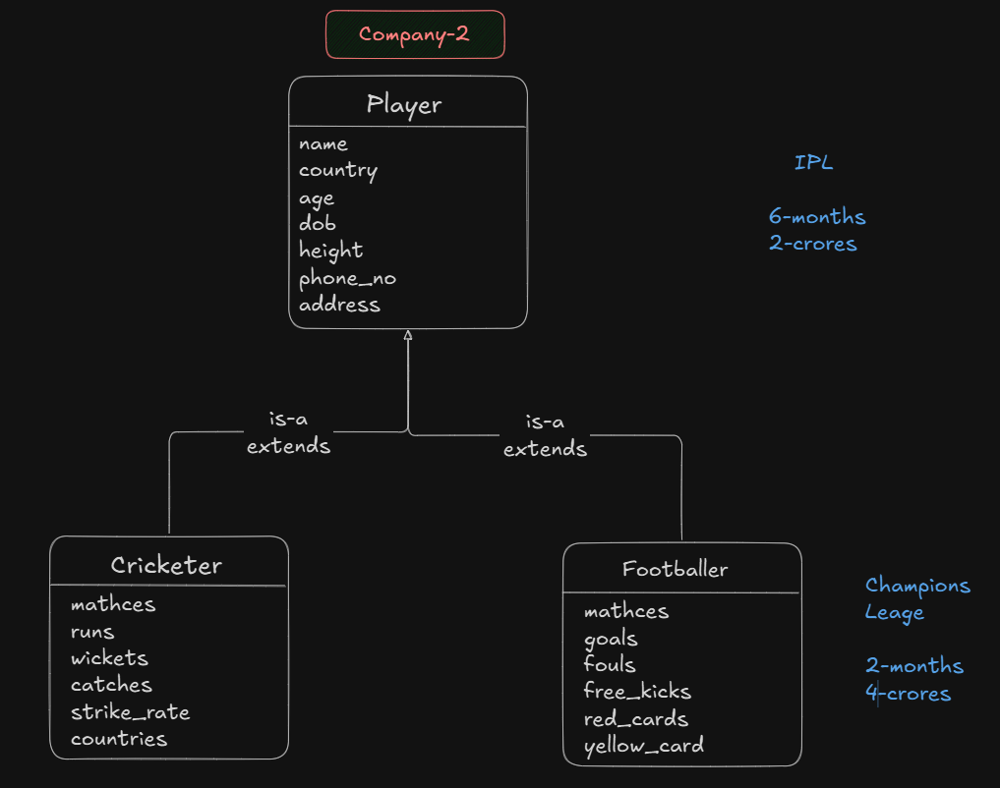
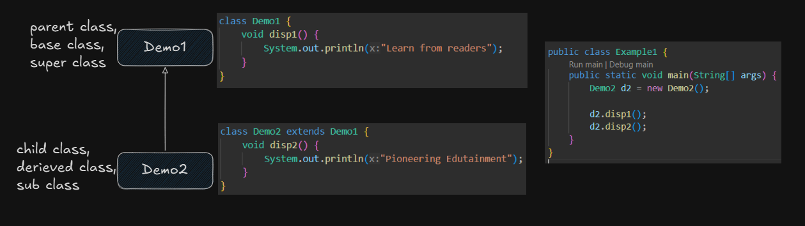
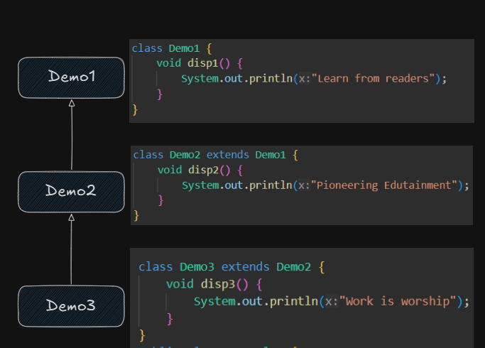
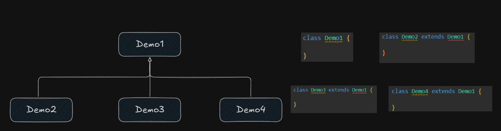

# Inheritance In Java

    

Story of Shilpa Shetty and Vijay Malya :

    
    
 Deal With Company-1

    
    
 Deal With Company-2

    

> Inheritance refers to the process of coding a project not as a single class, but as a hierarchy of classes

> Inheritance represents, the "is-a" relationship

> Which is also known as <u>parent-child relationship</u>

>  Inheritance is such a programming mechanism provided by most programming languages particularly object oriented in which the objects of the child class, acquires all the properties(data) and behaviours(methods) of an object of the parent class.

#### Advantages
1. Promotes reusability
2. Reduces code redundancy
3. Less development time and effort
4. Increases profits 
5. Supports code extensibility

## Rules of inheritance

### 1. Single inheritance enables a child class to inherit from a single parent class.
- Single inheritance is permitted in java 

[Java Code](./example/Example1.java)

    

### 2. In multilevel inheritance, a child class inherits from a parent class and the child class also acts as the parent class to another class 

- Multi-level inheritance is permitted in java 

    

### 3. In hierarchial inheritance, one class serves as a parent class to more than one child class
- Hierarchial inheritance is permitted in java 

    

### 4. 