# Polymorphism in java

## Accesing Overridden methods

#### Non-polymorphic version:

<p>
    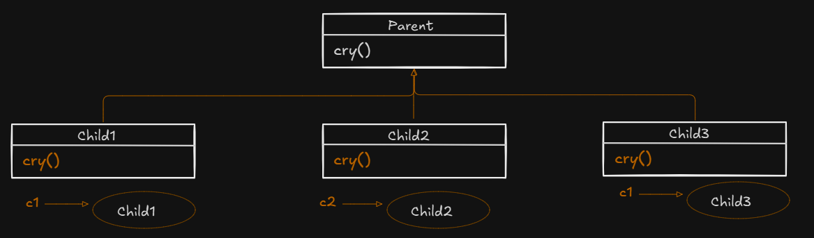
</p>

- [Java code of non-polymorphic](./examples/intro/IntroExNonPolymorphic.java)

<p>
    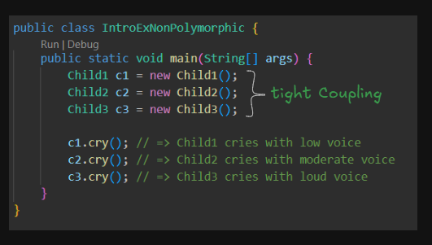
</p>

Relationship of cry method =>  $3: 3 = 1:1$

> Polymorphism -> Poly(many) + morph(Different forms)
- $1 : \text{Many}$

Examples of polymorphism in nature:

- **Carbon** exists in 1) Graphite, 2) Diamond, 3) Coal..
- **Water** exists in 1) Solid, 2) Liquid, 3) Gaseous..

- In the above example, we cannot achieve polymorphism because the relationship is $3:3$ or $1:1$ and not $1 : \text{Many}$.
- This is because, in the above example tight-coupling exists and hence polymorphism cannot be achieved.
- Tight-coupling refers to the process of creating child-type reference to child-type object
- If polymorphism must be achieved we should have loose-coupling as shown below.
- Loose coupling refers to the process of creating parent-type reference to child-type objects

#### Polymorphic Version

<p>
    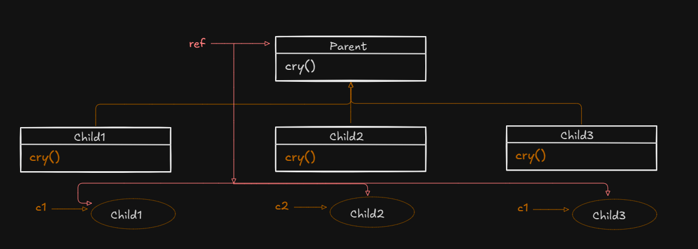
    <p>UML</p>
</p>

- [Java code of polymorphic](./examples/intro/IntroExPolymorphic.java)

- The above implementation referred to as ***Tight coupling or upcast***


<p>
    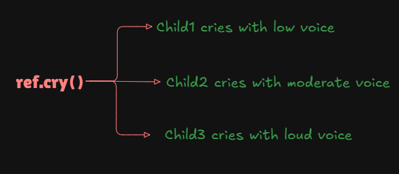
</p>

- Relationship : ($1: 3 = 1: \text{many}$)
- Hence it is a **real polymorphism**


#### Ploymorphism 

- It refers to the ability of an object to take on multiple forms.

- **Dynamic method dispatch** : It is the mechanism by which a call to an overridden method is resolved at run-time rather than compile time.
- When an overridden method is called through a parent reference, java(JVM) determines which version (Parent/Child) of that method is to be executed based upon the type of the object being refrred to at the time call occurs. Thus determination is made at the run-time.
- At run-time it depends on the type of the object being referred to (not the type of the reference variable) that determines which version of the overridden method will be executed.


## Accessing Specialised Method

<p>
    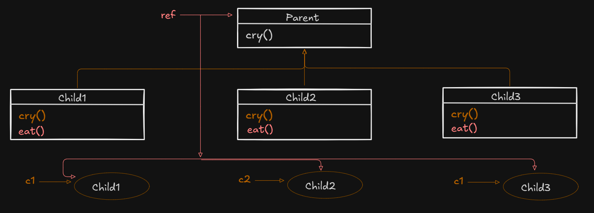
    <p> UML </p>
</p>

- [Example of java code](./examples/)

<p>
    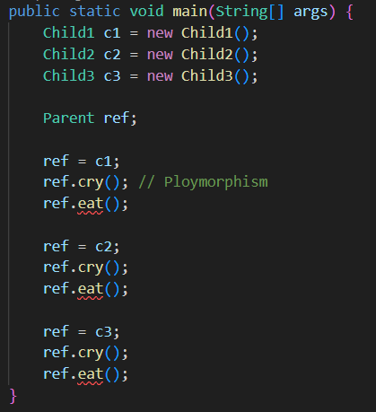
    <p align="center"> Error in accessing directly eat method </p>
</p>

<br>

- The error in the above program is because we are trying to access the specialised method of the child class using the parent type reference directly.
- The limitation of parent-type reference to child object is that using parent type reference we can not access the specialised methods of the child objects directly. In otherword, using parent reference we can access only inherited method and overridden methods. 
- The compiler check for method is performed on the basis of the type of reference, so in the parent class the method will not be present, hence compiler error.
- The error of the above program can be overcome by performing down-casting
- Down-casting refers to the process of temporarily converting parent-type reference to child-type so that the specialized method of the child class can be accessed.

<p>
    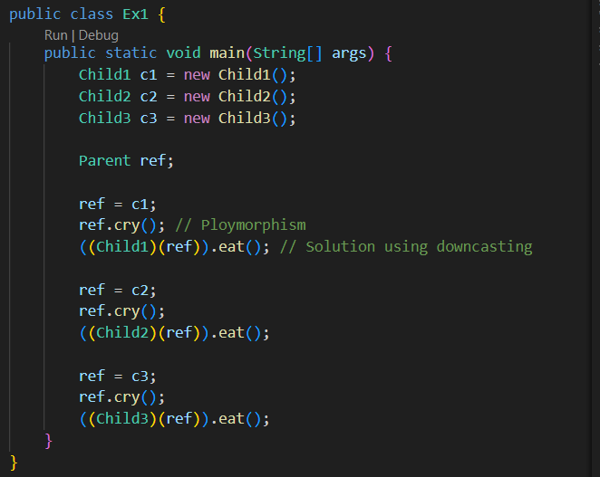
</p>


NOTE:

<p>
    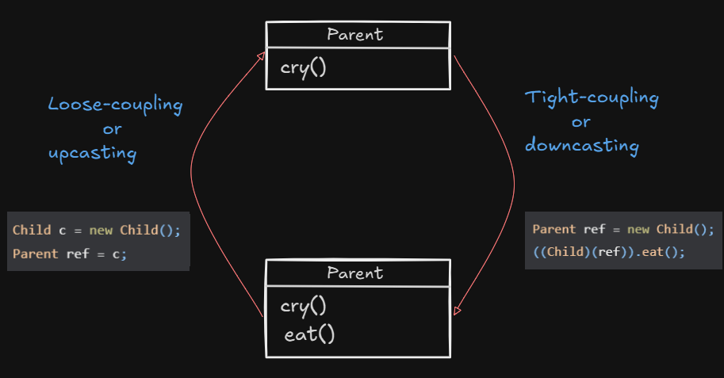
</p>


|Advantage of Upcasting| Advantage of Downcasting|
|--|--|
|Polymorphism can be achieved| Using parent-type reference we can access the specialised method of the child class|
|Code flexibility| |
|Code reduction| |


## Advantages of Polymorphism 

### 1. Plane hierarchy 

<p>
    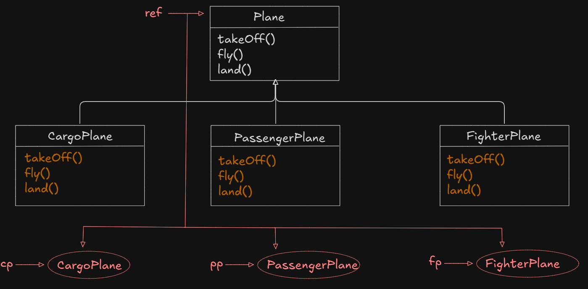
    <p align="center">UML of PlaneApp</p>
</p>

- [Plane App Java Code](./examples/advantage/PlaneExample.java)

<p>
    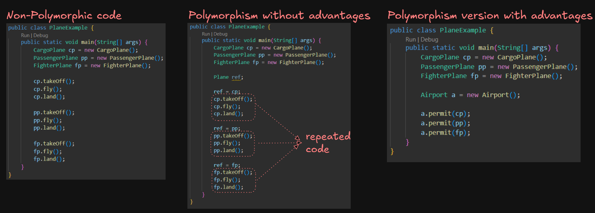
    <p align="center">Different implementation and leveraging power of polymorphism</p>
</p>

### 2. Animal Hierarchy

<p>
    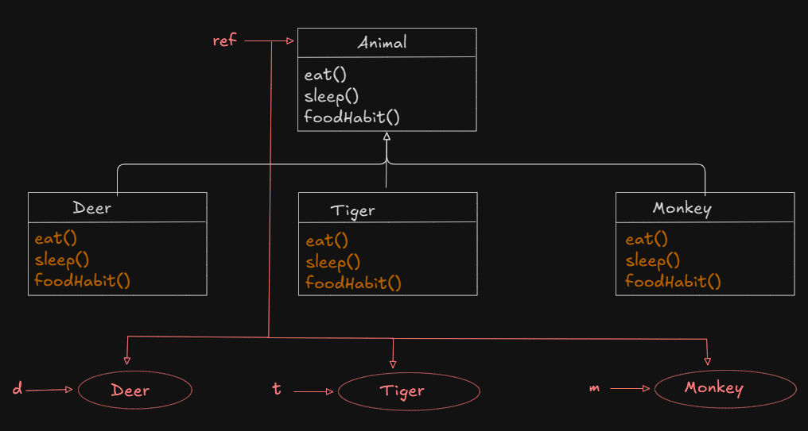
    <p align="center">UML of AnimalApp</p>
</p>

- [Animal App Java Code](./examples/advantage/AnimalApp.java)


<p>
    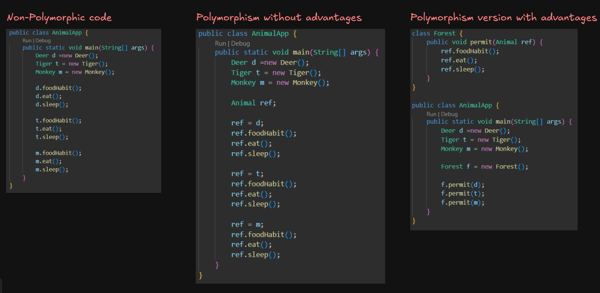
    <p align="center">Different implementation and leveraging power of polymorphism</p>
</p>


## Types of polymorphism

<p>
    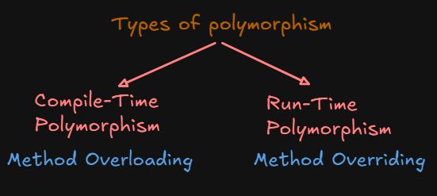
</p>

### 1. Compile-time Polymorphism/ Virtual/ Static/ Compile-time binding/ Early binding/ Static binding


<p>
    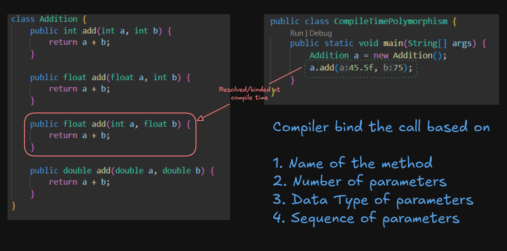
</p>


### 2. Run-time Polymorphism/ Real/ Dynamic/ Run-time Binding

<p>
    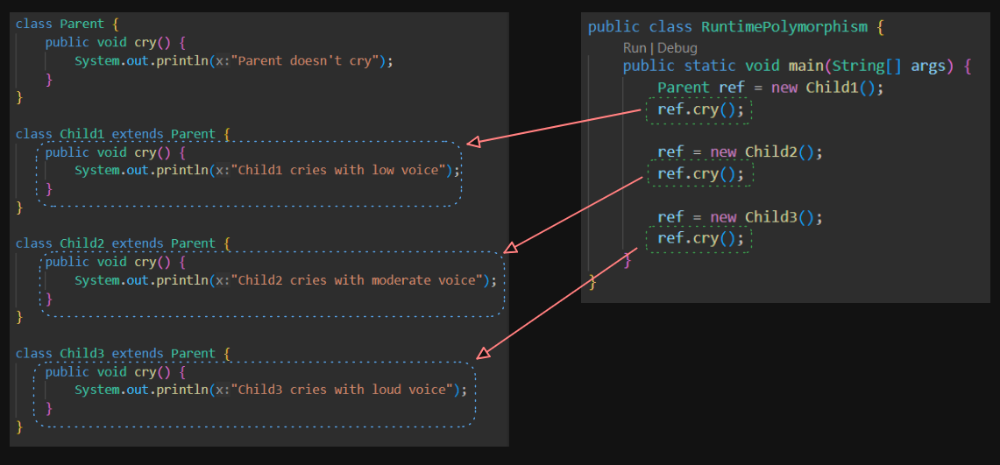
</p>


**Ponder upon this question: Do static members participate in inheritance?**

> ##### Rule - 9
- Answer: Yes it does participate in inheritance, this is rule number-9 of inheritance.

Example:

```java
class Parent {
    static int a = 10;

    static void disp() {
        System.out.println("Parent-static method");
    }
}

class Child extends Parent {

}

class Launch {
    public static void main(String...args) {
        Child.disp(); // Parent-static method
        System.out.println(Child.a);
    }
}
```

## Overriding with respect to Static methods

- Static methods cannnot be overridden as they are resolved `compile-time` based on the type of the reference. This is known as **method hiding** where the parent class static method is hidden by child class static method.

1. Case-1

```java
class Parent {
    static void disp() {
        System.out.println("Parent-static method");
    }
}

class Child extends Parent {
    void disp() { // Error : overridden method is static -> this instance method cannot override the static method from parent
        System.out.println("Child-instance method");
    }
}
```

2. Case-2

```java
class Parent {
    void disp() {
        System.out.println("Parent-instance method");
    }
}

class Child extends Parent {
    static void disp() { // Error : overriding method is static -> this static method cannot hide the instance method from parent
        System.out.println("Child-static method");
    }
}
```

3. Case-3

```java
class Parent {
    void disp() {
        System.out.println("Parent-instance method");
    }
}

class Child extends Parent {
    void disp() { // Method overriding
        System.out.println("Child-instance method");
    }
}
```

4. Case-4

```java
class Parent {
    static void disp() {
        System.out.println("Parent-static method");
    }
}

class Child extends Parent {
    static void disp() { // Method hiding
        System.out.println("Child-static method");
    }
}

class Launch {
    public static void main(String...args) {
        Parent ref1 = new Parent();
        ref1.disp();   // Parent-static method

        Child ref2 = new Child();
        ref2.disp();   // Child-static method

        Parent ref3 = new Child();
        ref3.disp();   // Parent-static method
    }
}
```


## `instanceof` operator

- The `instanceof` operator is used to check whether an object is an instance of a particular class or not. It is also know as *type comparision operator*.
- It returns `true` or `false`
Syntax:
```java
objectName instanceof className
```

Example : 

```java
CargoPlane cp = new CargoPlane();
FighterPlane fp = null;
System.out.println(cp instanceof CargoPlane); // true
System.out.println(cp instanceof PassangerPlane);  // Compilation Error
System.out.println(cp instanceof FighterPlane);    // Compilation Error
System.out.println(cp instanceof Plane); // true
System.out.println(fp instanceof FighterPlane); // false
```

> NOTE: `instanceof` operator is very useful to avoid ClassCastException. 

Example :
```java
class Animal {}
class Deer extends Animal {}
class Tiger extends Animal {}

public class Launch {
    public static void main(String...args) {
        Animal a = new Deer();// Upcasting: Deer To Animal (Valid)
        Tiger c = (Tiger) a;  // Downcasting Animal to Tiger (Invalid)
        System.out.println("Successfully casted to a tiger");
    }
}
```

- Above code will generate `ClassCastException`.