# Static keyword / Modifier in java

- Static keyword can be applied to `variables`, `blocks`, `methods` and `inner classes`.

> Components of a class
1. Variables
2. Blocks
3. Methods


<p align="center">
    
</p>


JVM is divided into 3 categories:
1. Class loader subsysem (3 activities)
2. Runtime data area(5 areas)
3. Execution engine(3 componenets)

Classloader subsystem performs 3 activities: 
### 1) Loading : loads the files into metaspace 
1. Bootstrap class loader : Repsonsible for loading JDK classes
2. Extension class loader : Responsible for loading classes that are an exension of the standard core java class.
3. Application class loader : Responsible for an application specific.

> Classloader work on the principle of **deligation hierarchy model**. The is, the request to load a class will be first deligated to its parents class loader. It only loads the class if the parent did not find find the class to load.

### 2) Linking : Performs verification, preparation and (optionally) resolution
1. Verify 
    - Bytecode Verifier will verify whether the generated bytecode is proper or not
    - If a calss fails verification then `VerifyError` is thrown

2. Prepare
    - Memory will be allocated for static variables and default value will be assigned.
3. Resolve
    - All symbolic memory referenced are replaces with the original reffernces from method area.

### 3) Initialisation : Static variables will be assigned with this original values and static blocks will be executed


<p>
    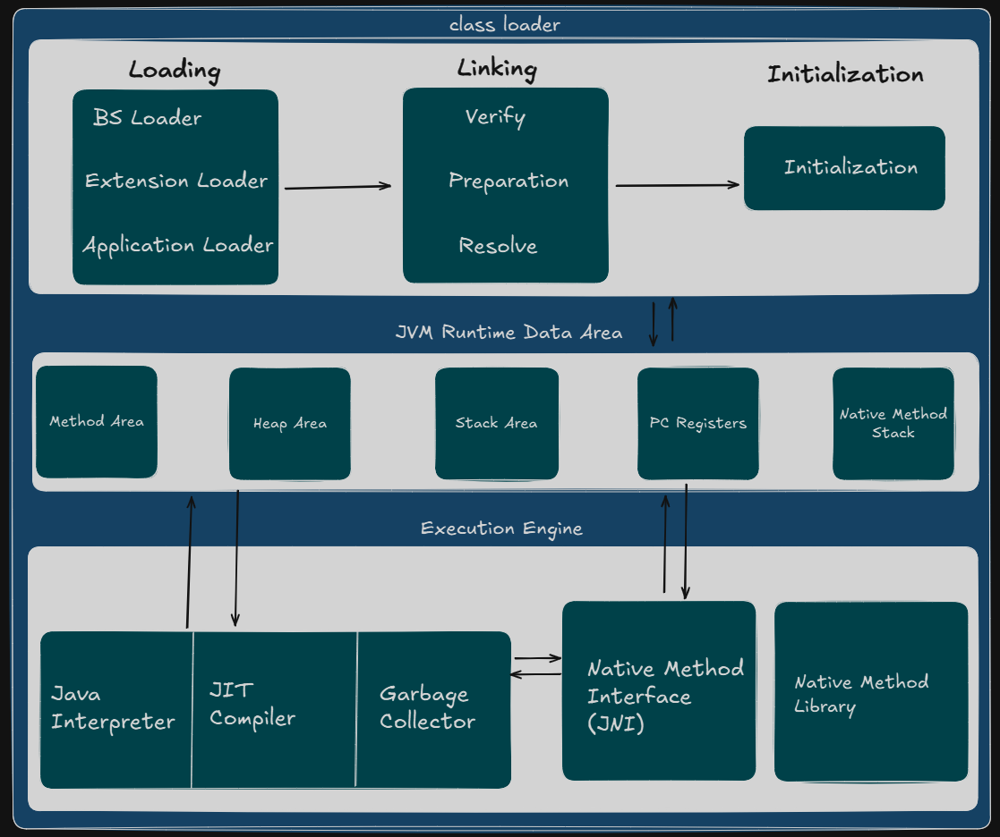
    <p align="center">Detailed Architecture of JVM</p>
</p>


#### <u>Runtime Data Area</u>:
1. Method area : class metadata, code for methods/constructor
2. Heap Area: Objects, instance variables, static members
3. Stack area : Stack frames for methods, local variables
4. Program Counter registers : Address of instructions
5. Native Method stack : Native method information

#### <u>Execution Engine</u>
- The JVM then involves the `main()` method of the class & executes is using the execution engine. The executino engine executes the bytecodes loaded into the memory area using an interpreter and JIT compiler.
1. Java Interpreter : It interprets the non-hotspot bytecodes to MLL codes
2. JIT Compiler : It computes the hotspot bytecode to MLL code
3. Garbage Collector: It collects and removes unreferenced objects.

Examples :
### Static Control flow

Ex : 1 -> [Java Code](./Example/StaticExample1.java)
<p>
    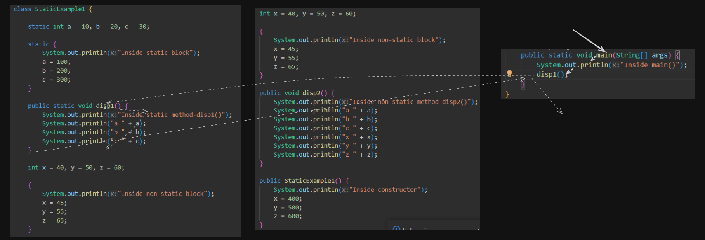
    <p align="center"> Static Control flow</p>
    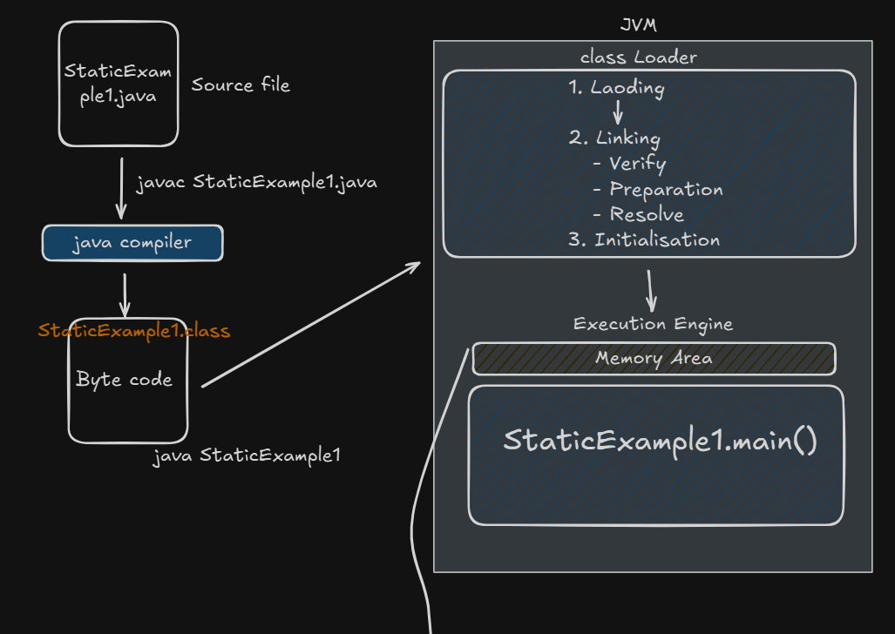
    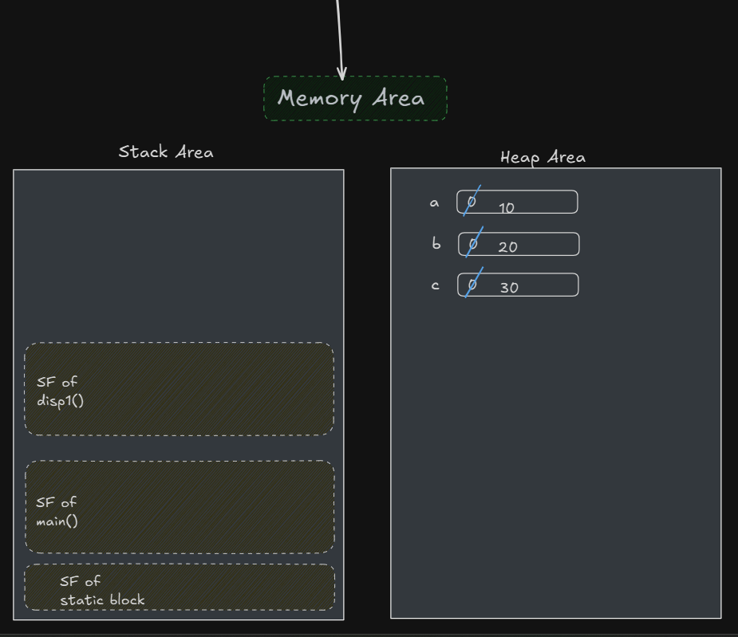
    <p align="center"> Memory Map</p>
</p>

Ouput:
```
Inside static block
Inside main()
Inside static method-disp1()
a 100
b 200
c 300
```


### Instance Control Flow
Ex : 2 -> [Java Code](./Example/StaticExample2.java)
<p>
    
    <p align="center"> Static Control flow</p>
    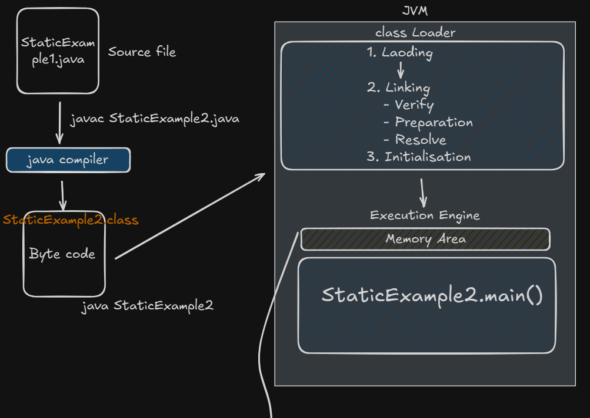
    
    <p align="center"> Memory Map</p>

</p>


### Accessibility Rule

Ex: 3 -> [Java Code](./Example/StaticExample3.java)

<p>
    
    <p align="center">Compilation Error</p>
    <p>NOTE : Byte code will not be generated as there are error in the program. Below diagram is only for explanation purpose</p>
    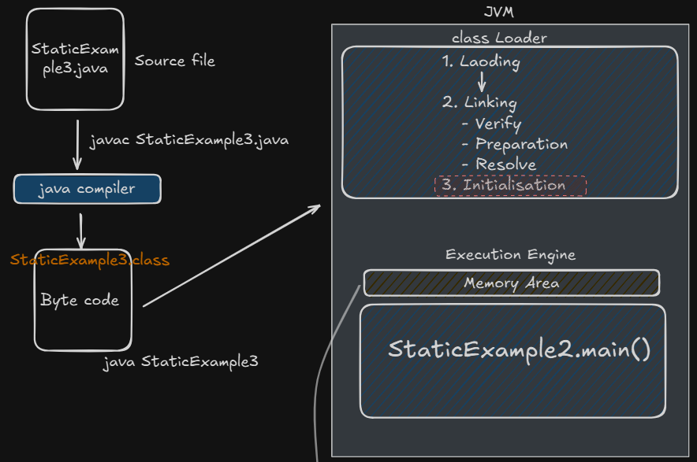
    <p align="center">
        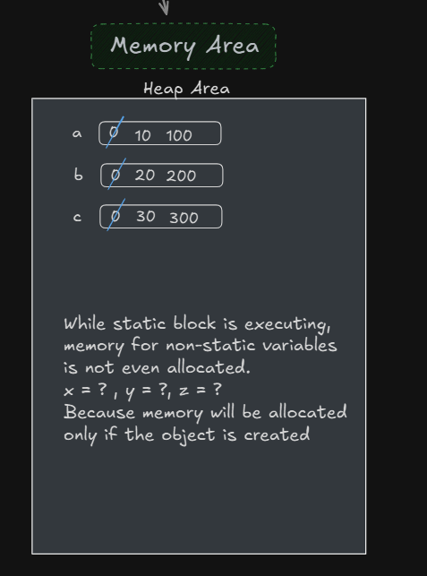
    </p>
    <p align="center"> Memory Map</p>

</p>

### Need of main method

Ex: 4 -> [Java Code](./Example/StaticExample4.java)

<p>
    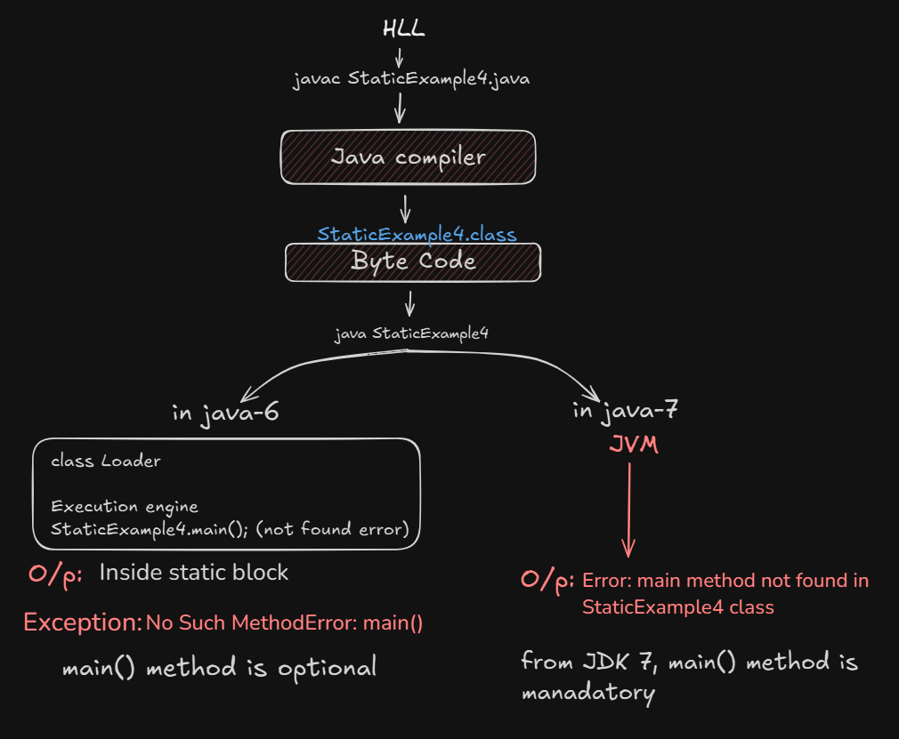
</p>

### Class Loading Mechanism

Ex: 5 -> [Java Code](./Example/StaticExample5.java)

Output:
```

```
<p>
    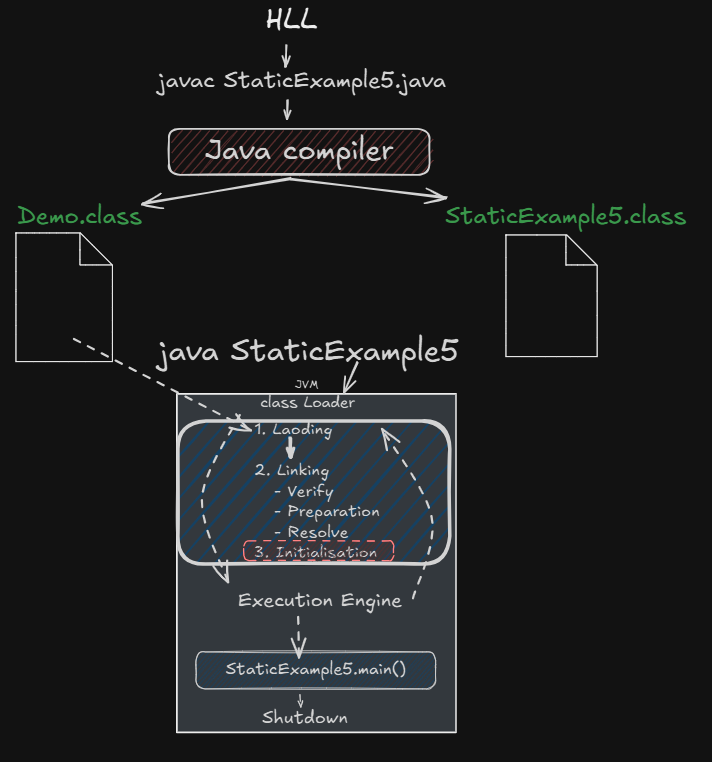
</p>

<p>
    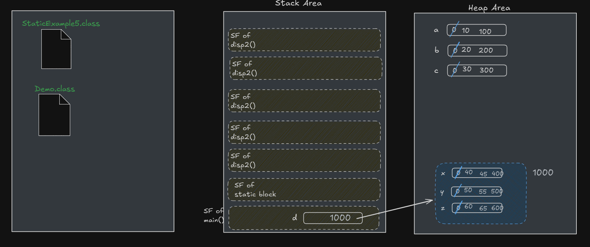
</p>


### Non-static block vs Constructor

<p>
    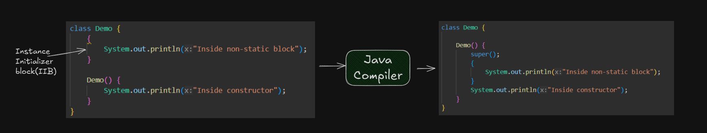
</p>

> Question : 1 -> Count the number of objects the user have created of particular class?

Solution: [Java code](./Example/Question1.java)  

### Application of static members


Application of static members -> [Java Code](./Example/FarmerApp.java)

<p>
    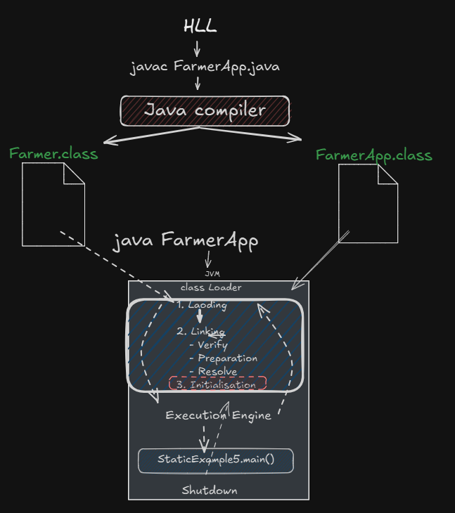
    <p align="center">Execution flow and class loading of farmer app</p>
</p>
<p>
    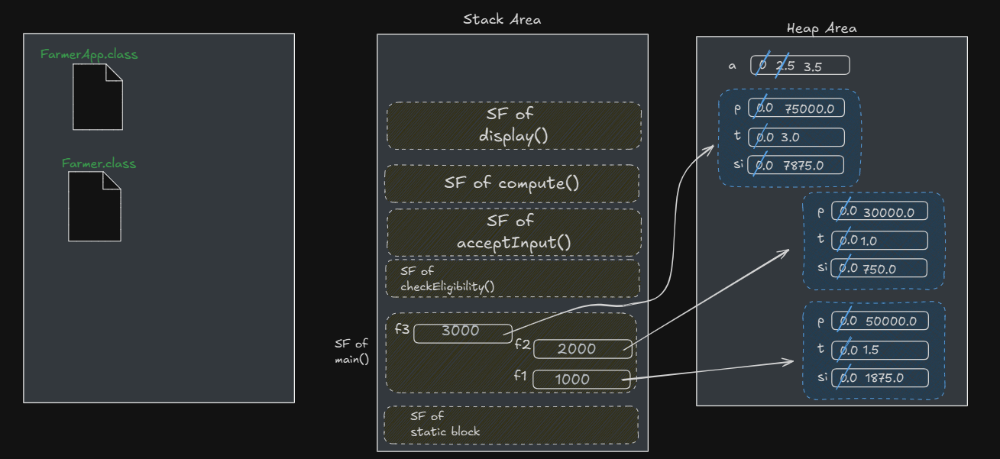
    <p align="center">FarmerApp Memory</p>
</p>


